# Pilot Kit Box (ESP32-P4 Edition)

<p align="center">
  <strong>开源低成本飞行数据盒子与态势感知设备 | Open-source low-cost flight data box and situational-awareness device</strong><br>
  官方网站 / Official website: <a href="https://air.club">air.club</a><br>
  网页刷机 / Web flasher: <a href="https://updater.pilotkit.app">updater.pilotkit.app</a>
</p>

> **分支 `v4`。** 主机是 **Waveshare ESP32-P4-WIFI6-Touch-LCD-4.3** 一体板：
> ST7701 480×800 MIPI-DSI 面板以 PPA 旋转成 800×480 横屏，GT911 触摸，
> P4NRW32 + ESP32-C6。硬件目标是
> [`hardware/expansion-board-v4/`](hardware/expansion-board-v4/) 的 6 层集成
> 扩展板——以 HAT 方式直插载板 2×20 排母，把 1090/978 接收链、GNSS、IMU、
> 气压计和电源整合到一块板上，**自带 1090 接收链，不再需要 RTL-SDR dongle**。
> 每个硬件版本一个分支；`docs/jlc/lcd-2.4in-8pin/` 与下文 2.4 寸载板内容
> 保留为 v0.8.0 历史 PCB 参考，不代表本分支的当前接线。
>
> **Branch `v4`.** Host board: **Waveshare ESP32-P4-WIFI6-Touch-LCD-4.3**.
> The hardware target is the 6-layer integrated expansion board in
> [`hardware/expansion-board-v4/`](hardware/expansion-board-v4/), which stacks
> onto the carrier's 2×20 header and folds the 1090/978 receive chains, GNSS,
> IMU, barometer, and power onto one board — **no RTL-SDR dongle required**.
> One branch per hardware revision.

## 项目概览 / Overview

**Pilot Kit Box** 是一个开源、低成本、便携式的飞行数据盒子和航空态势感知设备，可与 [Pilot Kit](https://air.club) 深度结合使用，也可以作为独立设备运行。

如果你熟悉 Stratux、Sentry、Garmin GDL 系列或 uAvionix ping 这类便携式 ADS-B / 飞行数据盒子，可以把 Pilot Kit Box 理解成一个更开放、更低成本、可自己搭建和二次开发的替代方案。它面向飞行员、飞行学员、飞行爱好者以及通航开发者，用常见硬件完成飞行记录、姿态显示、周边交通接收和后续数据分析。

它的核心价值不是单纯“看天上有哪些飞机”，而是帮助用户低成本记录、理解和管理自己的飞行数据。它可以随飞机一起使用，记录每一次飞行中的关键数据，用于飞行日志、回放、分享和分析；也可以接收附近飞机公开广播的 ADS-B / Mode-S 信号，在本机屏幕上显示周边交通信息。

你可以把它理解成一个“飞行员自己的小型数据记录与接收盒子”：它既能独立工作，也能和 Pilot Kit 紧密结合；未来也可以通过标准航空数据格式与 Garmin Pilot、ForeFlight 等第三方 EFB 软件配合使用。

Pilot Kit Box can work as a standalone device or integrate closely with [Pilot Kit](https://air.club). If you know products such as Stratux, Sentry, Garmin GDL, or uAvionix ping, Pilot Kit Box is best understood as a more open, lower-cost, builder-friendly flight data and ADS-B box. It is intended for pilots, student pilots, aviation enthusiasts, and general-aviation developers who want local flight recording, attitude display, nearby traffic reception, and data they can later review or share.

The main point is not just watching aircraft overhead. Pilot Kit Box is meant to help users record, understand, and manage their own flying at a much lower cost. It can record each flight for logs, replay, sharing, and analysis; it can also receive public ADS-B / Mode-S broadcasts from nearby aircraft and show surrounding traffic on the built-in display.

Think of it as a pilot's own small flight data recorder and receiver: it can run independently, integrate tightly with Pilot Kit, and evolve toward standard aviation data outputs for third-party EFB apps such as Garmin Pilot and ForeFlight.

## 使用场景 / Use Cases

Pilot Kit Box 的核心用途是：让普通飞行员、飞行学员和飞行爱好者，也能用较低成本拥有一个自己的飞行记录和态势感知盒子。

Pilot Kit Box is designed to give pilots, student pilots, and aviation enthusiasts an affordable personal flight recording and situational-awareness box.

- 记录自己的每一次飞行，为飞行日志、回放、分享和分析提供数据基础。<br>Record each flight as source data for logs, replay, sharing, and analysis.
- 在本机屏幕上显示姿态、航向、高度、速度、垂直速度等飞行状态信息。<br>Display flight state such as attitude, heading, altitude, speed, and vertical speed on the local screen.
- 接收附近飞机的 ADS-B / Mode-S 广播，显示周边交通、航班号、国家、航司、机型和注册号等信息。<br>Receive nearby ADS-B / Mode-S traffic and show callsign, country, airline, aircraft type, and registration when known.
- 在没有互联网的情况下，本地接收和记录航空数据，而不是依赖在线航班网站。<br>Receive and record aviation data locally without relying on online flight-tracking websites.
- 与 Pilot Kit 软件结合，把硬件采集到的数据用于更完整的飞行记录、回放、分析和分享体验。<br>Use captured device data with Pilot Kit for richer flight records, replay, analysis, and sharing.
- 作为通用飞行数据盒子继续扩展；路线图中的 GDL90 over Wi-Fi 目标是连接 Garmin Pilot、ForeFlight 等 EFB。<br>Continue evolving as a general-purpose flight data box; the roadmap GDL90 over Wi-Fi path targets EFBs such as Garmin Pilot and ForeFlight.
- 给通航、航电、嵌入式和 SDR 爱好者提供一个完整、开源、可学习的参考实现。<br>Provide a complete open-source reference for general aviation, avionics, embedded systems, and SDR builders.

## 为什么要做这个设备 / Why Build This

市面上已经有 Stratux、Sentry、Garmin GDL、uAvionix ping 等便携式 ADS-B 接收器、飞行记录盒子和通航辅助设备，但很多产品要么价格较高，要么生态相对封闭，要么不方便用户理解、修改和扩展内部的数据链路。

Pilot Kit Box 想解决的是这个问题：

- **低成本**：用 ESP32-P4、RTL-SDR、屏幕、IMU 和常见电源模块，做出一个普通用户也能负担的飞行数据盒子。
- **通用性**：它不是只能配合某一个 App 使用的封闭硬件；它可以独立使用，也可以面向标准航空数据接口继续扩展。
- **与 Pilot Kit 紧密结合**：Pilot Kit 可以充分利用 Box 采集的数据，提供更完整的飞行记录、回放、分析和分享能力。
- **本地记录**：飞行数据可以在设备本地记录，为飞行复盘和个人飞行档案提供基础。
- **态势感知**：除了记录自己的飞行，也能接收附近 ADS-B / Mode-S 交通，帮助理解周边空域情况。
- **开源透明**：从 SDR 接收、ADS-B 解码、状态聚合、屏幕显示到数据库维护，整个链路都可以检查、修改和复现。
- **可继续扩展**：它可以是一个低成本替代方案，也可以作为移动端、云端分析、EFB 集成、Wi-Fi GDL90 输出和硬件外壳迭代的平台。

Portable ADS-B receivers and flight data boxes already exist, including Stratux, Sentry, Garmin GDL, and uAvionix ping. Many of them are effective products, but they can be expensive, relatively closed, or hard for users to inspect, modify, and extend.

Pilot Kit Box focuses on:

- **Low cost**: ESP32-P4, RTL-SDR, display, IMU, and common power modules keep the hardware approachable.
- **General-purpose use**: it is not locked to one app; it can run on its own and evolve toward standard aviation data interfaces.
- **Tight Pilot Kit integration**: Pilot Kit can use Box data for richer flight records, replay, analysis, and sharing.
- **Local recording**: flight data can be recorded on the device for review and personal archives.
- **Situational awareness**: the same box can receive nearby ADS-B / Mode-S traffic and help users understand surrounding airspace.
- **Open implementation**: SDR reception, ADS-B decoding, state fusion, display rendering, and database maintenance are all inspectable and reproducible.
- **Room to grow**: it can be a low-cost alternative today and a platform for mobile apps, cloud analysis, EFB integration, Wi-Fi GDL90 output, and enclosure iterations later.

## 技术概览 / Technical Overview

当前 ESP32-P4 版本把传统依赖 Linux 板卡的 ADS-B 接收链路压缩到单片机 + RTOS 架构：ESP32-P4 通过原生 USB 2.0 HS 直接驱动 RTL-SDR，实时接收 1090 MHz ADS-B / Mode-S 信号，在本机完成 dump1090 派生的 DSP 解码、CPR 定位融合、飞机状态聚合，并通过 BLE GATT、串口以及 LittleFS / MicroSD 文件输出给移动端或调试工具。

The ESP32-P4 edition removes the Linux SBC from the ADS-B path: the P4 drives an RTL-SDR receiver over native USB 2.0 HS, decodes 1090 MHz ADS-B / Mode-S frames on-device, fuses per-aircraft state, and publishes traffic over BLE GATT, serial output, and LittleFS or MicroSD logs.

## 安全与适航边界 / Safety And Certification Boundary

Pilot Kit Box 是开源原型和态势感知设备，当前仓库没有 FAA、EASA、CAAC 或其他适航/TSO 认证。它不能作为主飞行仪表、备用飞行仪表、导航源或防撞系统使用；任何飞行决策必须以认证航电、机载仪表、目视观察和适用法规为准。

Pilot Kit Box is an open-source prototype and situational-awareness device. This repository does not represent FAA, EASA, CAAC, TSO, or other airworthiness certification. Do not use it as a primary flight instrument, backup flight instrument, navigation source, or collision-avoidance system; flight decisions must remain based on certified avionics, installed instruments, visual scan, and applicable regulations.

## 当前状态 / Current Status

截至 **2026-07-29**，当前 4.3 寸固件已经覆盖 ADS-B 接收与解码、BLE
GDL90 分发、GPS 定位与 RMC 授时、BMP388 气压高度、LittleFS/MicroSD
记录、ST7701 MIPI-DSI 横屏显示、GT911 触摸导航、交通雷达、ADS-B 列表、
实时诊断、本地航空识别数据库和 BNO085 姿态融合。

As of **2026-07-29**, the current 4.3-inch firmware includes ADS-B reception
and decode, BLE GDL90 distribution, GPS positioning and RMC time sync,
BMP388 barometric altitude, LittleFS/MicroSD recording, an ST7701 MIPI-DSI
landscape display, GT911 touch navigation, traffic radar, ADS-B list, live
diagnostics, local aviation identity databases, and BNO085 attitude fusion.

### `v0.8.0` 发布重点 / Release Highlights

- 新增 360° 交通雷达、PFD HSI 前方交通叠加和统一 own-ship 航向决策。<br>Adds the 360-degree traffic radar, forward-traffic HSI overlay, and unified own-ship heading selection.
- 新增 BMP388 气压高度/升降率、可调 QNH，以及可滚动实时 DIAG 页面。<br>Adds BMP388 altitude/vertical speed, adjustable QNH, and the scrollable live DIAG page.
- 增强 GT-U8 GPS/北斗诊断和 RMC 授时，并通过 BLE 输出 GDL90 Ownship Report；GPIO50 PPS 仍是未实现预留。<br>Expands GT-U8 GPS/BeiDou diagnostics, RMC time sync, and BLE GDL90 Ownship Report output; GPIO50 PPS remains an unimplemented reservation.
- 新增 MicroSD 探测、Flash/MicroSD 日志切换、约 1 GiB 轮转保留和受保护格式化。<br>Adds MicroSD detection, Flash/MicroSD log selection, about 1 GiB rotation retention, and guarded formatting.
- 完成 2.4 寸载板、板载 1090 MHz IFA 天线、3D 打印外壳和面板原型实物验证。<br>Documents the fabricated 2.4-inch carrier, on-board 1090 MHz IFA antenna, printed enclosure, and faceplate prototype.

## 核心特性 / Features

| 功能 | Feature | 状态 / Status |
|---|---|---|
| ESP32-P4 + FreeRTOS 固件，无 Linux 启动链路 | ESP32-P4 + FreeRTOS firmware, no Linux boot chain | 已实现 / Implemented |
| USB 2.0 HS 直连 RTL-SDR，1090 MHz，2 MSPS IQ8 数据流 | USB 2.0 HS RTL-SDR path at 1090 MHz, 2 MSPS IQ8 | 已实现 / Implemented |
| 512 KiB IQ ring buffer、非阻塞 USB 回调、DSP 任务解码 | 512 KiB IQ ring buffer, non-blocking USB callback, DSP decode task | 已实现 / Implemented |
| dump1090 派生 Mode-S 解码、CRC 过滤、CPR 全球定位 | dump1090-derived Mode-S decode, CRC filtering, CPR global position decode | 已实现 / Implemented |
| 最多同时跟踪 64 个 ADS-B / Mode-S 目标，并聚合呼号、高度、位置、速度、垂直速度、应答机码和机型信息 | Tracks up to 64 ADS-B / Mode-S targets at once, aggregating callsign, altitude, position, velocity, vertical rate, squawk, and aircraft type | 已实现 / Implemented |
| UART、LittleFS / MicroSD 轮转文件、BLE raw ts-line 三路记录输出 | UART, rotating LittleFS/MicroSD files, and BLE raw ts-line output | 已实现 / Implemented |
| BLE GATT：GDL90 Ownship、Traffic、Heartbeat、Raw、Time Sync | BLE GATT: GDL90 Ownship, Traffic, Heartbeat, Raw, and Time Sync | 已实现 / Implemented |
| iOS Current Time Service 自动校时，Android/跨平台可写 Time Sync | iOS Current Time Service auto-sync, Android/cross-platform Time Sync writes | 已实现 / Implemented |
| GT-U8 GPS / 北斗定位、RMC 授时、GPS own-ship 兜底 | GT-U8 GPS/BeiDou positioning, RMC time sync, GPS own-ship fallback | 已实现；PPS 未实现 / Implemented; PPS not implemented |
| BMP388 气压高度和升降率，QNH 可调 | BMP388 barometric altitude and vertical speed with adjustable QNH | 已实现 / Implemented |
| ST7701 480×800 MIPI-DSI 面板，PPA 转为 800×480 横屏，双 DPI buffer | ST7701 480×800 MIPI-DSI panel, PPA-transformed to 800×480 landscape with dual DPI buffers | 已实现 / Implemented |
| G1000 风格 PFD：姿态、航向/HSI、高度带、GS/VS、ADS-B 数量 | G1000-style PFD: attitude, heading/HSI, altitude tape, GS/VS, ADS-B count | 已实现 / Implemented |
| 360° 交通雷达：航向朝上/北向上、2/5/10/20 NM、目标选择和相对高度 | 360° traffic radar: heading-up/north-up, 2/5/10/20 NM, target selection, relative altitude | 已实现 / Implemented |
| PFD HSI 前方交通叠加和后方目标计数 | Forward-traffic overlay and aft-target count on the PFD HSI | 已实现 / Implemented |
| ADS-B 列表页：ICAO、呼号、国家、ALT、SPD、HDG、VS、SQK、TYPE 和详情面板 | ADS-B list page: ICAO, callsign, country, ALT, SPD, HDG, VS, SQK, TYPE, and detail pane | 已实现 / Implemented |
| 本地航空识别数据库：航司 ICAO/IATA、运营人名称、ICAO24 国家、注册号、机型和型号 | Local aviation identity databases: airline ICAO/IATA, operator name, ICAO24 country, registration, type, and model | 已实现 / Implemented |
| BNO085 100 Hz 姿态融合、校准向导和导航网格长按“调平”持久化 | BNO085 100 Hz attitude fusion, calibration wizard, and persistent nav-grid Level action | 已实现 / Implemented |
| Settings / About / Diagnostics / Compass Calibration 中英文 UI，配置写入 NVS | English/Chinese Settings, About, Diagnostics, and Compass Calibration UI with NVS persistence | 已实现 / Implemented |
| Noto Sans SC 字形生成、中文 LCD 锐化曲线、英文硬像素路径 | Noto Sans SC glyph generation, sharpened CJK LCD alpha curve, crisp English bitmap path | 已实现 / Implemented |
| GT911 触摸 FAB 打开全屏导航网格直接切页（两页 10 项可翻页），FAB 可拖动记忆，详情页三路返回 | GT911 touch FAB opens a full-screen nav grid (10 items on two swipeable pages), remembers FAB position, and provides three detail-page back paths | 已实现 / Implemented |
| RTL-SDR IQ stall 触发软重连，多次失败后才重启整机 | RTL-SDR IQ-stall soft re-init before full restart fallback | 已实现 / Implemented |

## 硬件清单 / Hardware Bill of Materials

### 硬件预览 / Hardware Preview

| PFD / Primary Flight Display | ADS-B LIST / Aircraft List |
|---|---|
| 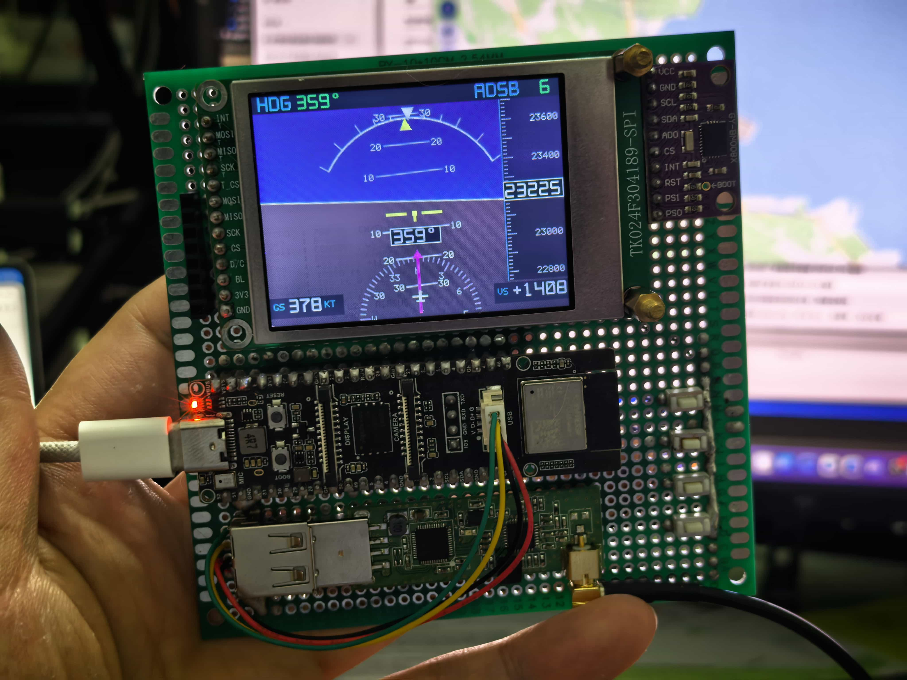 | 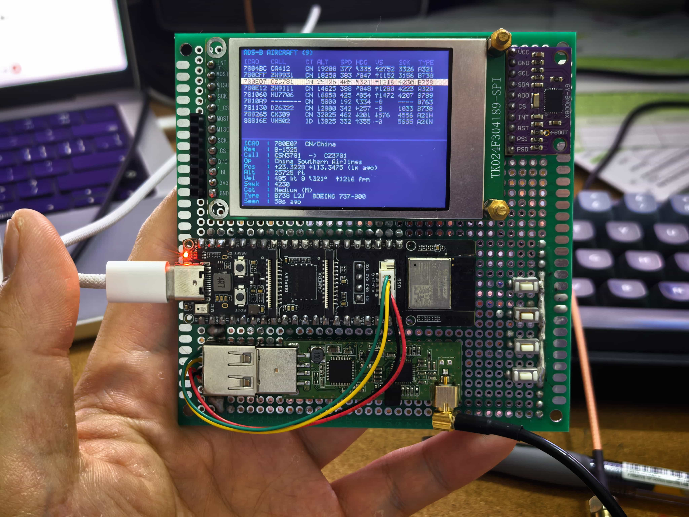 |

| 交通雷达 / Traffic Radar | 完整原型 / Finished Prototype |
|---|---|
| 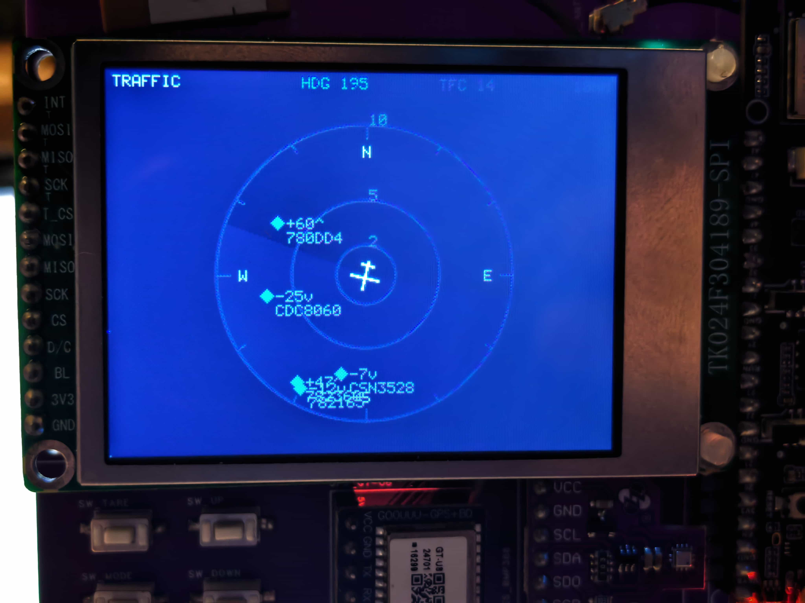 | 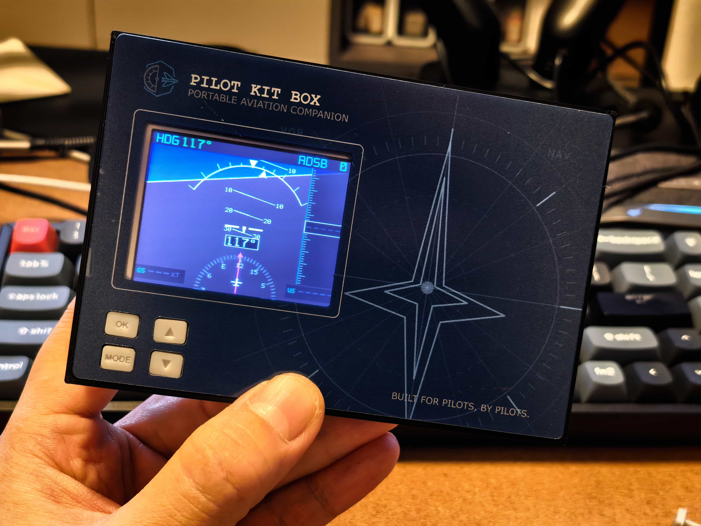 |

### 历史载板与外壳 / Legacy Carrier Board & Enclosure

以下 2.4 寸载板照片和设计只记录 v0.8.0 历史原型，不是当前 Rev1.2
4.3 寸板的装配或接线指南。历史立创EDA 工程见
[`docs/jlc/lcd-2.4in-8pin/`](docs/jlc/lcd-2.4in-8pin/)。

The following 2.4-inch carrier photos and design files document the legacy
v0.8.0 prototype. They are not assembly or wiring instructions for the
current Rev1.2 4.3-inch board. Legacy EasyEDA sources:
[`docs/jlc/lcd-2.4in-8pin/`](docs/jlc/lcd-2.4in-8pin/).

| 载板 3D · 正面 / PCB 3D Front | 载板 3D · 背面（电池面）/ PCB 3D Back (battery side) |
|---|---|
| 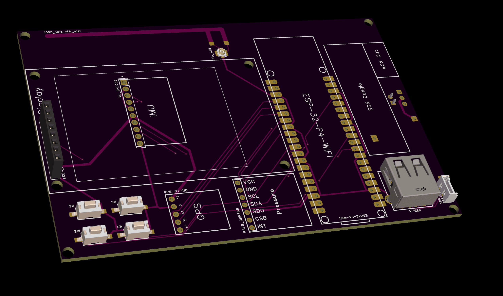 | 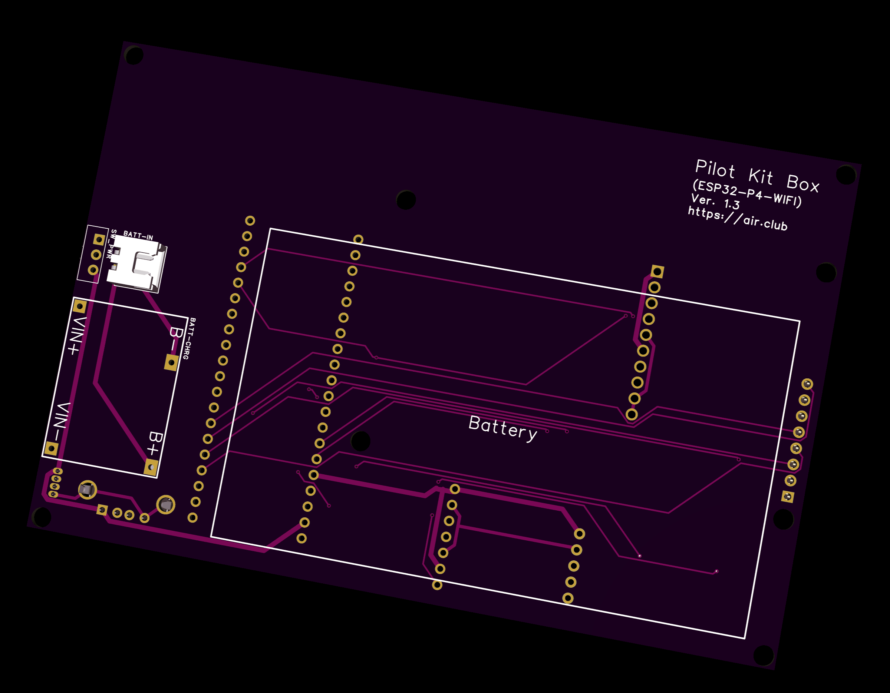 |

| 布线 · 顶层 / Routing Top | 布线 · 底层 / Routing Bottom |
|---|---|
| 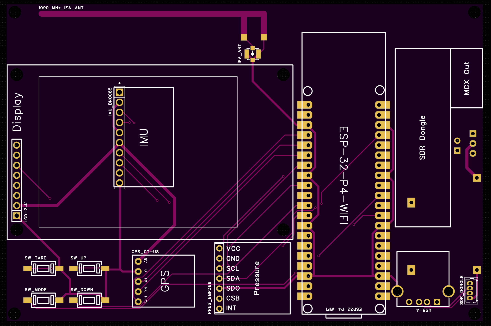 | 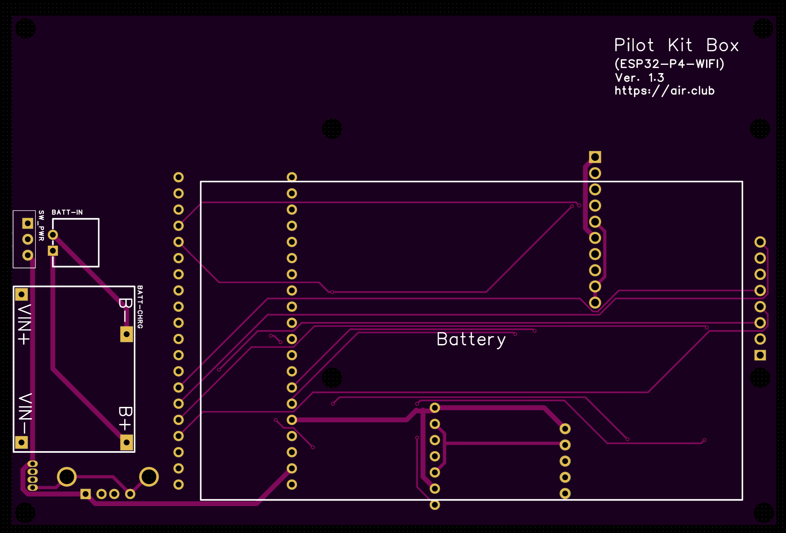 |

| 外壳面板 / Enclosure Faceplate | 外壳成品 / Enclosure |
|---|---|
| 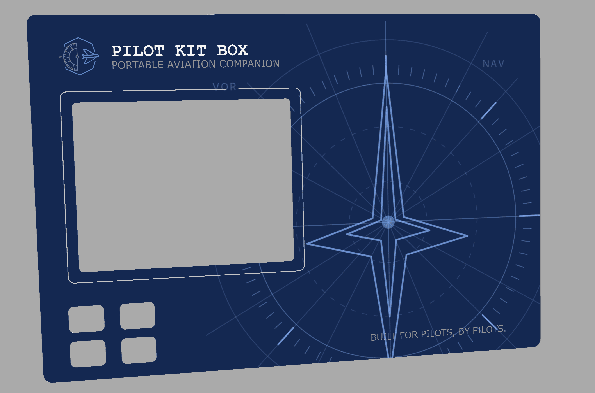 | 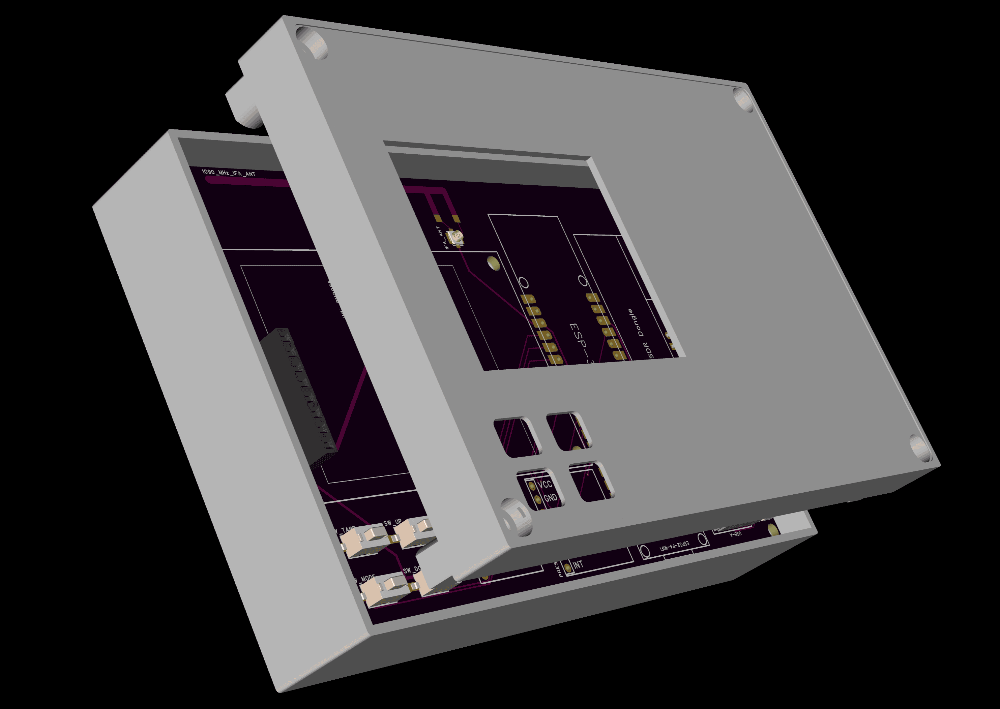 |

### 实物打样与装配 / Fabrication & Assembly

| 载板实物 / Fabricated Carrier PCB | 载板装配 / Assembled Carrier |
|---|---|
| 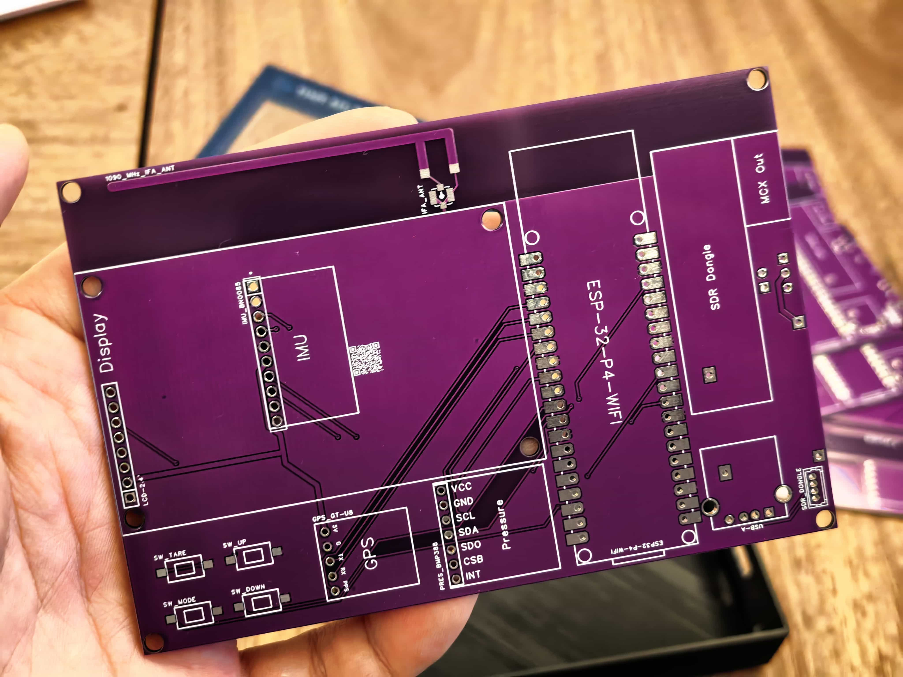 | 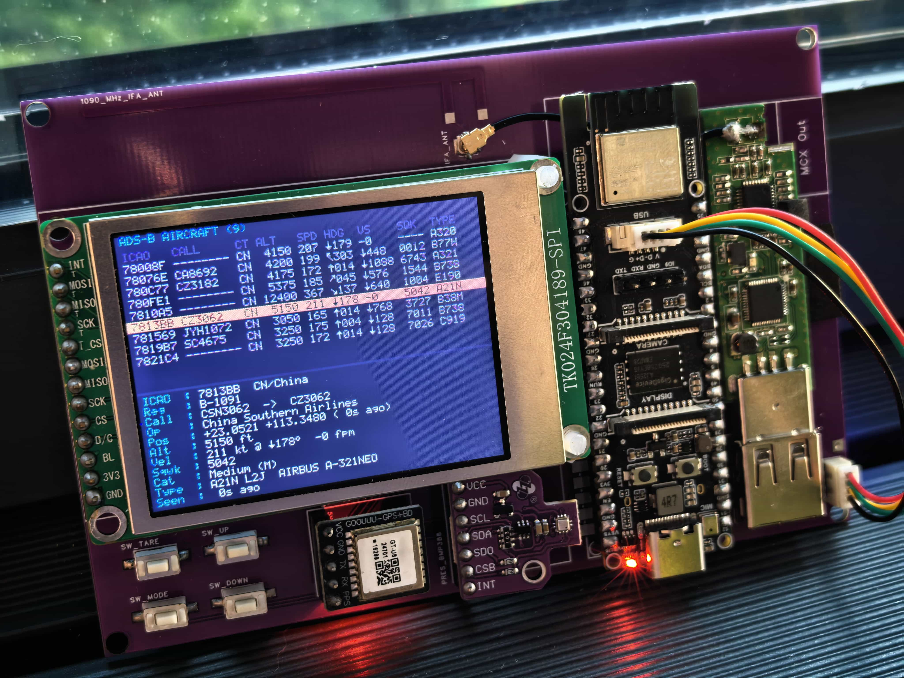 |

| 3D 打印外壳 / Printed Enclosure | 面板装配完成 / Finished Faceplate Assembly |
|---|---|
| 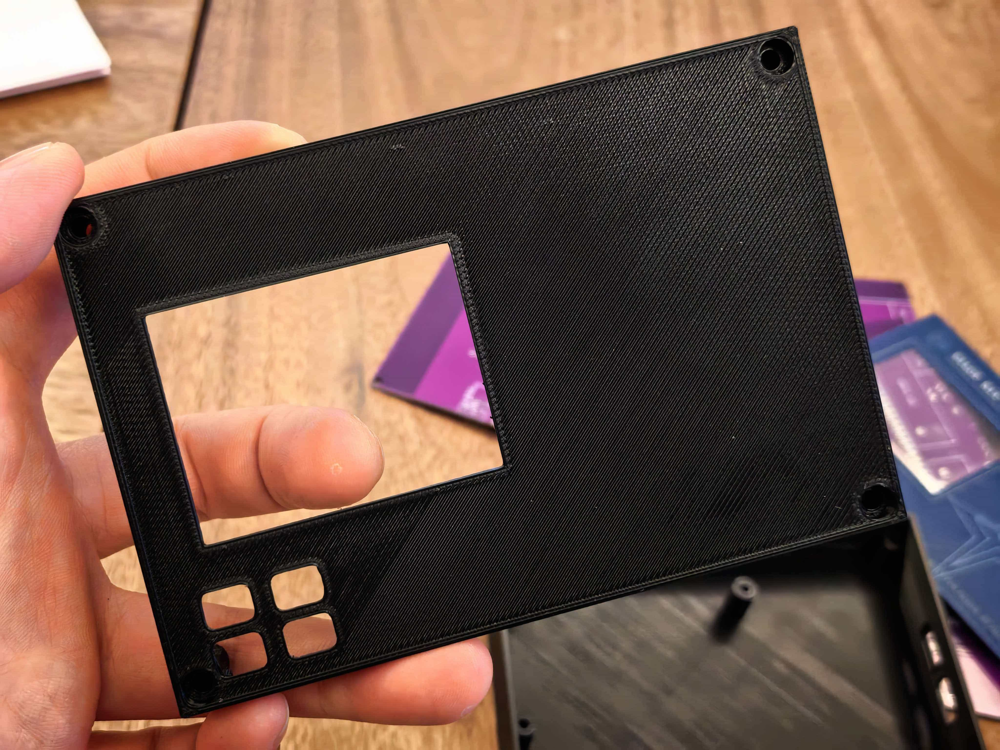 |  |

### 必备硬件 / Required

| 硬件 | Hardware | 说明 / Notes |
|---|---|---|
| Waveshare ESP32-P4-WIFI6-Touch-LCD-4.3 | Waveshare ESP32-P4-WIFI6-Touch-LCD-4.3 | Rev1.2 一体板：ESP32-P4NRW32、32 MB NOR、32 MB PSRAM、ESP32-C6、ST7701 和 GT911。<br>Rev1.2 integrated board with ESP32-P4NRW32, 32 MB NOR, 32 MB PSRAM, ESP32-C6, ST7701, and GT911. |
| USB-C 数据线 | USB-C data cable | 用于 P4 烧录、串口监视和供电；必须是数据线。<br>Used for P4 flashing, serial monitoring, and power; it must support data, not charge-only. |
| RTL-SDR FC0013 USB Dongle | RTL-SDR FC0013 USB dongle | 当前推荐 FC0013 tuner 版本，成本低，适合本项目 1090 MHz ADS-B 接收；固件按 1090 MHz / 2 MSPS 配置，并使用最大手动增益。<br>Currently recommended with the FC0013 tuner because it is inexpensive and suitable for this 1090 MHz ADS-B receiver; firmware defaults to 1090 MHz / 2 MSPS and max manual gain. |
| USB-C OTG 转接头或有源 USB Hub | USB-C OTG adapter or powered USB hub | 仅裸板需要：把 RTL-SDR 接到 H2 原生 USB 2.0 HS Type-C。装上载板时 dongle 直接插载板 USB-A（走 J3-27/25），H2 空置；P1 是 C6 下载排针。<br>Bare board only: connects RTL-SDR to the H2 native USB 2.0 HS Type-C. With the carrier fitted the dongle plugs into the carrier USB-A (J3-27/25) and H2 stays empty; P1 is the C6 download header. |
| 1090 MHz ADS-B 天线 | 1090 MHz ADS-B antenna | 接 RTL-SDR；实际接收距离强依赖天线位置和供电噪声。<br>Connects to the RTL-SDR; real-world range depends strongly on antenna placement and power noise. |
| GY-BN008X / BNO085 IMU 模块 | GY-BN008X / BNO085 IMU module | I2C0：SDA GPIO7、SCL GPIO8；RST GPIO28；INT GPIO34（轮询）；AD0 接 GND，地址 `0x4A`。<br>I2C0: SDA GPIO7, SCL GPIO8, RST GPIO28, INT GPIO34 (polled), AD0 grounded for `0x4A`. |
| GT-U8（ATGM336H）GPS/北斗模块 | GT-U8 (ATGM336H) GPS/BeiDou module | UART1 9600 8N1：P4 TX GPIO49 → 模块 RXD，模块 TXD → P4 RX GPIO51；PPS 接 GPIO50 但固件未使用。<br>UART1 at 9600 8N1: P4 TX GPIO49 to module RXD, module TXD to P4 RX GPIO51; PPS is wired to GPIO50 but unused by firmware. |
| BMP388 气压计模块 | BMP388 barometer module | I2C0：SDA GPIO7、SCL GPIO8；SDO 接 GND，地址 `0x76`；INT 接 GPIO31 但固件轮询。提供气压高度与升降率。<br>I2C0: SDA GPIO7, SCL GPIO8, SDO grounded for `0x76`; INT wired to GPIO31 but the driver polls. Supplies pressure altitude and vertical speed. |

### 集成扩展板 V4.0（研发中）/ Integrated Expansion Board V4.0 (In Development)

| 正面 / Top | 背面 / Bottom |
|---|---|
| 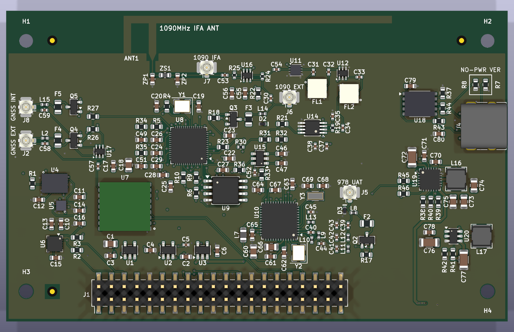 | 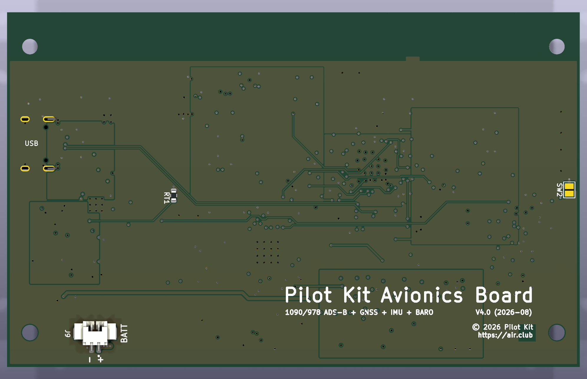 |

上面「必备硬件」里的 RTL-SDR dongle、BNO085、GT-U8 和 BMP388 四个分立模块，
正在被一块**集成扩展板**取代。它以 HAT 方式直插 Waveshare 载板的 2×20 排母，
把接收链、传感器和电源整合到一块 6 层板上，并**自带 1090 MHz 接收链，不再需要
RTL-SDR dongle**。工程、文档与制造包在
[`hardware/expansion-board-v4/`](hardware/expansion-board-v4/)（该目录的
[README](hardware/expansion-board-v4/README.md) 是双语的）。

The four discrete modules listed under Required Hardware above (RTL-SDR dongle,
BNO085, GT-U8, BMP388) are being replaced by a single **integrated expansion
board**. It stacks onto the Waveshare carrier's 2×20 header as a HAT and folds
the receive chains, sensors, and power into one 6-layer PCB — including its own
**1090 MHz receive chain, so no RTL-SDR dongle is needed**.

| 项目 | Item | 规格 / Specification |
|---|---|---|
| 板框 / 层数 | Outline / layers | 100.1 × 62.1 mm，6 层（JLC06161H-3313），L1→In1 介质 0.0994 mm，50Ω 微带 0.15 mm<br>100.1 × 62.1 mm, 6 layers; 0.0994 mm L1→In1 dielectric, 0.15 mm 50Ω microstrip |
| 1090 MHz 接收 | 1090 MHz receive | QPL9547 LNA + TA0970A SAW + BGA2817 + AD8313 对数检波 + TLV3501 比较器 → RP2040 PIO 解码<br>QPL9547 LNA, TA0970A SAW, BGA2817, AD8313 log detector, TLV3501 comparator into an RP2040 PIO decoder |
| 978 MHz UAT | 978 MHz UAT | CC1312R1F3RGZR Sub-GHz 收发器 + 差分 LC 匹配<br>CC1312R1F3RGZR sub-GHz transceiver with differential LC matching |
| 天线 | Antennas | 板载 1090 IFA（PCB 铜箔，π 网络可调）+ 三个 U.FL 外接口（1090 / 978 / GNSS）<br>On-board 1090 IFA (PCB copper, tunable π network) plus three U.FL ports (1090 / 978 / GNSS) |
| 传感器 | Sensors | ATGM336H-6N-74 GNSS、BNO085 IMU、BMP388 气压计、QMC5883P 磁力计<br>ATGM336H-6N-74 GNSS, BNO085 IMU, BMP388 barometer, QMC5883P magnetometer |
| 电源（选贴）| Power (optional) | CH224K PD 诱骗 9V + SY6970 充电/电量计 + SY7069 升压 5V + 单节锂电<br>CH224K PD sink at 9V, SY6970 charger/fuel gauge, SY7069 5V boost, single-cell Li-po |
| 规模 | Scale | 177 个位置、386 个过孔（全部 ≥0.3 mm 钻孔）<br>177 placements, 386 vias (all ≥0.3 mm drill) |

**状态**：布局布线完成，DRC 零违例、未连通 0，Gerber/钻孔可导出；**尚未打样**。
板载 IFA 天线已落板但**未经实测调谐**，必须装盒后用 VNA 校准，
见 [`BOM_IFA_TUNING.md`](hardware/expansion-board-v4/BOM_IFA_TUNING.md)。

**Status**: layout and routing complete with zero DRC violations and zero
unconnected nets; Gerbers and drill files export cleanly. **Not yet fabricated.**
The on-board IFA antenna is laid out but **not empirically tuned** — it requires
VNA calibration in the final enclosure.

| 文档 | Document | 内容 / Contents |
|---|---|---|
| [`PINMAP.md`](hardware/expansion-board-v4/PINMAP.md) | 权威引脚/网络映射 / Authoritative pin and net map |
| [`ASSEMBLY.md`](hardware/expansion-board-v4/ASSEMBLY.md) | 手工贴片点位清单（脚本从板子生成）/ Hand-assembly placement list, generated from the board |
| [`CHECKLIST.md`](hardware/expansion-board-v4/CHECKLIST.md) | 按位号贴片核对表（另附 .xlsx/.pdf 打印版）/ Per-reference placement checklist (with printable .xlsx/.pdf) |
| [`VARIANTS.md`](hardware/expansion-board-v4/VARIANTS.md) | 带电源 / 不带电源两个选贴版本 / Powered and unpowered assembly variants |
| [`SELECTIVE_PLACEMENT.md`](hardware/expansion-board-v4/SELECTIVE_PLACEMENT.md) | 贴装分组与互斥规则（贴错会烧板）/ Placement groups and mutex rules |
| [`BOM_PURCHASE.md`](hardware/expansion-board-v4/BOM_PURCHASE.md) | 权威采购清单（脚本从网表生成）/ Authoritative purchasing list, generated from the netlist |
| [`BOM_IFA_TUNING.md`](hardware/expansion-board-v4/BOM_IFA_TUNING.md) | IFA 调谐备料与装盒 VNA 调试流程 / Antenna tuning kit and the in-enclosure VNA procedure |
| [`BASEBOARD_REF.md`](hardware/expansion-board-v4/BASEBOARD_REF.md) | 载板机械参数基准 / Mechanical reference for the Waveshare carrier |

以上文档均提供英文正名版与 `-zh_CN.md` 简体中文版；完整索引见
[`hardware/expansion-board-v4/README.md`](hardware/expansion-board-v4/README.md)。
Each ships as an English canonical file plus a `-zh_CN.md` Simplified-Chinese
counterpart; see the v4 README for the full index.

### 历史 BOM 成本参考 / Legacy BOM Cost Reference

以下成本表属于旧 2.4 寸 v0.8.0 原型，保留用于历史复盘，**不能**作为当前
4.3 寸一体板的采购清单。价格、汇率和供应情况也没有更新。

The following costs belong to the legacy 2.4-inch v0.8.0 prototype and remain
only for historical review. They are **not** a procurement list for the
current 4.3-inch integrated board, and prices/exchange rates are not current.

| 物料 | Part | 人民币参考 / RMB Reference | 美元估算 / USD Estimate | 备注 / Notes |
|---|---|---:|---:|---|
| 微雪 ESP32P4C6 | Waveshare ESP32P4C6 | ¥76 | ~$11.40 | ESP32-P4 + ESP32-C6 |
| BNO085 IMU | BNO085 | ¥76 | ~$11.40 | 9 轴姿态融合 / 9-axis fusion |
| 气压计 BMP388 | BMP388 barometer | ¥13 | ~$1.95 | `v0.8.0` 新增 / Added in `v0.8.0` |
| GPS GT-U8（ATGM336H） | GT-U8 (ATGM336H) GNSS | ¥25 | ~$3.75 | GPS / 北斗；u-blox M9N 可替代但成本更高 / GPS + BeiDou |
| RTL-SDR FC0013 | RTL-SDR FC0013 | ¥10 | ~$1.50 | 1090 MHz ADS-B |
| IPEX、MCX、SMA 线座 | RF cables and adapters | ¥2 | ~$0.30 | 天线与 SDR 连接 / Antenna and SDR interconnect |
| 5V 2A / 2.4A Type-C 充电模块 | 5V Type-C charging module | ¥4 | ~$0.60 | 电池供电 / Battery power |
| 3.7V 10000mAh 锂电池 | 3.7V 10000mAh Li-ion battery | ¥25 | ~$3.75 | |
| 2.4 寸半透反射屏 | 2.4-inch transflective LCD | ¥38 | ~$5.70 | |
| USB-A 母座 | USB-A socket | ¥0.3 | ~$0.05 | |
| 嘉立创 PCB | JLCPCB carrier PCB | ¥7 | ~$1.05 | 裸板参考 / Bare PCB reference |
| **电子件小计** | **Electronics subtotal** | **约 ¥276.3** | **约 $41.45** | |
| 嘉立创 3D 打印外壳 | JLC 3D-printed enclosure | ¥50 | ~$7.50 |  |
| 嘉立创面板打印 | JLC faceplate print | ¥10 | ~$1.50 |  |
| **原型合计（全部）** | **Complete prototype total** | **约 ¥336.3** | **约 $50.45** | |

### 首次设置或选配 / Setup And Optional

| 硬件 | Hardware | 说明 / Notes |
|---|---|---|
| USB-UART 转接器 | USB-UART adapter | 每块新 Waveshare 板首次烧 ESP32-C6 hosted slave 固件时需要；详见 [`docs/hardware/c6_slave_firmware.md`](docs/hardware/c6_slave_firmware.md)。<br>Required once per fresh Waveshare board to flash the ESP32-C6 hosted slave firmware; see [`docs/hardware/c6_slave_firmware.md`](docs/hardware/c6_slave_firmware.md). |
| 杜邦线 / 短接线 | Jumper wires / shorting wire | 连接 IMU/GPS/BMP388，以及 C6 首次烧录时把 P1-3 IO9 短接到 GND。<br>Used for IMU/GPS/BMP388 wiring and shorting P1-3 IO9 to GND during first-time C6 flashing. |
| 5V 2A / 2.4A Type-C 口充电模块 | 5V 2A / 2.4A Type-C charging module | 电池供电版本使用；给系统提供稳定 5V 输入。<br>Used in battery-powered builds to provide a stable 5V system input. |
| 3.7V 10000mAh 锂电池 | 3.7V 10000mAh lithium battery | 便携版本的电源选项；容量可按外壳和续航目标调整。<br>Portable power option; capacity can be adjusted for enclosure size and endurance target. |
| 5 V 外部供电 | External 5 V power | RTL-SDR 功耗约数百 mA，电脑 USB 口供电不稳时建议使用更可靠供电。<br>RTL-SDR dongles can draw a few hundred mA; use a reliable 5V supply if a computer USB port is unstable. |
| 外壳、支架、屏蔽和固定件 | Enclosure, mounts, shielding, fixtures | 当前仓库主要维护固件和接线文档，机械结构可按实际安装补充。<br>This repository mainly maintains firmware and wiring docs; mechanical parts should be adapted to the actual installation. |

### 板载资源 / On-board Resources

- ESP32-C6-MINI-1 通过 SDIO 作为 Wi-Fi 6 / BLE 5 协处理器；当前固件使用 BLE。
- MicroSD 卡座已启用；设置页可在 10 MiB LittleFS 与 MicroSD 记录之间切换，并支持卡状态诊断和二次确认格式化。
- CH343P USB-UART 桥用于 P4 烧录和串口监视。
- ES8311 音频 codec、麦克风、扬声器功放为板载资源，当前航电路径尚未使用。

- The ESP32-C6-MINI-1 is connected over SDIO as the Wi-Fi 6 / BLE 5 co-processor; the current firmware uses BLE.
- The MicroSD slot is active; Settings can select 10 MiB LittleFS or MicroSD recording, with card diagnostics and guarded formatting.
- The CH343P USB-UART bridge handles P4 flashing and serial monitoring.
- The ES8311 codec, microphone, and speaker amplifier are on-board resources, not currently used by the avionics path.

## 目录结构 / Repository Structure

| 路径 | Path | 内容 / Contents |
|---|---|---|
| `firmware/` | `firmware/` | ESP-IDF v6.0.1 固件工程 / ESP-IDF v6.0.1 firmware project |
| `firmware/main/` | `firmware/main/` | 应用层 C 源码和编进固件的识别数据表（航司代码、ICAO24 国家段） / Application C sources and the identity tables compiled into the firmware (airline codes, ICAO24 countries) |
| `firmware/components/esp32-rtl-sdr/` | `firmware/components/esp32-rtl-sdr/` | RTL-SDR USB/SDR 组件 / RTL-SDR USB/SDR component |
| `firmware/scripts/` | `firmware/scripts/` | 字体、数据库和测试脚本 / Font, database, and test scripts |
| `hardware/expansion-board-v4/` | `hardware/expansion-board-v4/` | **当前硬件目标**：6 层集成扩展板 KiCad 工程、生成/校验脚本与装配文档 / **Current hardware target**: 6-layer integrated expansion board — KiCad project, generator/verification scripts, and assembly docs |
| `hardware/expansion-board-v3/` | `hardware/expansion-board-v3/` | 上一版 4 层扩展板（v3.2 已打样，已归档；仍用于固件调试）——见其 [README](hardware/expansion-board-v3/README.md) / Previous 4-layer expansion board (v3.2 fabricated, **archived**; still used for firmware debugging) — see its [README](hardware/expansion-board-v3/README.md) |
| `datafiles/` | `datafiles/` | SD 卡离线数据工作区：`data/` 机型库与航空数据 bin、`maps/` 底图包（内容不进 git，见 `datafiles/README.md`） / microSD offline data workspace: `data/` aircraft and aeronautical binaries, `maps/` basemap packs (contents gitignored, see `datafiles/README.md`) |
| `docs/` | `docs/` | 构建、协议、架构、用户和硬件文档 / Build, protocol, architecture, user, and hardware docs |
| `web/flasher/` | `web/flasher/` | ESP Web Tools 网页刷机页面 / ESP Web Tools web flasher |
| `tools/firmware_release/` | `tools/firmware_release/` | 固件发布打包工具 / Firmware release packaging tools |

## 航空识别数据库 / Aviation Identity Databases

盒子用三类本地识别数据库，把 ADS-B / Mode-S 中收到的 ICAO24 地址和呼号显示为更容易核对的航空信息。它们不是航班计划、航线、时刻表或实时联网数据。机型库放在 microSD 卡上（`/sdcard/aero/pk_actdb.bin`），更新只需把新文件拷进卡里，不用刷固件；航司代码表和 ICAO24 国家地址段仍编进固件镜像，随固件更新。

The box uses three local identity databases so ICAO24 addresses and ADS-B callsigns can be rendered as operationally useful aviation information. These are not flight-plan, route, timetable, or live network databases. The aircraft database lives on the microSD card (`/sdcard/aero/pk_actdb.bin`) and is refreshed by copying a new file onto the card — no reflash. The airline code table and ICAO24 country ranges are still compiled into the firmware image and ship with firmware updates.

| 数据库 | Database | 用途 / Purpose | 仓库位置 / Repository Location | 更新脚本 / Update Script |
|---|---|---|---|---|
| 飞机 ICAO24 数据库 | Aircraft ICAO24 database | ICAO24 -> 注册号、ICAO 机型代码、型号名称、Doc 8643 技术描述；当前快照约 574k 条记录、8.21 MB，随 SD 卡分发（`/sdcard/aero/pk_actdb.bin`），不再嵌入固件，开机后懒加载进 PSRAM，无卡时相关字段显示 `---`。<br>ICAO24 -> registration, ICAO type code, model name, and Doc 8643 descriptor; the current snapshot is about 574k records / 8.21 MB, shipped on the SD card (`/sdcard/aero/pk_actdb.bin`) rather than embedded in the firmware, and lazily loaded into PSRAM after boot; without a card those fields render as `---`. | `datafiles/data/pk_actdb.bin`（见 `datafiles/README.md`）, `firmware/main/aircraft_db.c`, `firmware/main/aircraft_db_reader.c`, `firmware/main/aircraft_db.h` | `firmware/scripts/gen_aircraft_db.py` |
| 航司代码表 | Airline code table | ADS-B 呼号前三位 ICAO 航司代码 -> IATA 代码和运营人名称，用于把 `CSN1234` 等显示为更常见的航班号形式。<br>ADS-B callsign ICAO prefix -> IATA code and operator name, used to render callsigns such as `CSN1234` in a more familiar form. | `firmware/main/airline_codes.c`, `firmware/main/airline_codes.h` | `firmware/scripts/gen_airline_codes.py --update-source` |
| ICAO24 国家地址段 | ICAO24 country ranges | ICAO24 地址段 -> ISO 3166-1 alpha-2 国家/地区代码和名称，用于 ADS-B LIST 的 CT 列和详情面板。<br>ICAO24 address range -> ISO 3166-1 alpha-2 country/region code and name for the ADS-B LIST CT column and detail pane. | `firmware/main/icao_country.c`, `firmware/main/icao_country.h` | `firmware/scripts/gen_icao_country.py` |

维护流程详见 / Maintenance workflow: [`docs/database_maintenance.md`](docs/database_maintenance.md) / [`docs/database_maintenance-zh_CN.md`](docs/database_maintenance-zh_CN.md)。

## 快速开始 / Quick Start

| 我想做什么 | What I want | English | 中文 |
|---|---|---|---|
| 从零安装、编译、烧录 | Set up, build, and flash from scratch | [`docs/BUILD.md`](docs/BUILD.md) | [`docs/BUILD-zh_CN.md`](docs/BUILD-zh_CN.md) |
| 用网页更新 ESP32-P4 固件 | Update ESP32-P4 firmware from browser | [updater.pilotkit.app](https://updater.pilotkit.app) | [updater.pilotkit.app](https://updater.pilotkit.app) |
| 发布维护者固件包 | Publish a maintainer firmware release | [`docs/firmware_update.md`](docs/firmware_update.md) | [`docs/firmware_update-zh_CN.md`](docs/firmware_update-zh_CN.md) |
| 看运行时任务和数据流 | Understand runtime tasks and data flow | [`docs/architecture.md`](docs/architecture.md) | [`docs/architecture-zh_CN.md`](docs/architecture-zh_CN.md) |
| 调整 sdkconfig | Tune sdkconfig options | [`docs/configuration.md`](docs/configuration.md) | [`docs/configuration-zh_CN.md`](docs/configuration-zh_CN.md) |
| 集成移动端 BLE | Integrate a mobile BLE client | [`docs/ble_protocol.md`](docs/ble_protocol.md) | [`docs/ble_protocol-zh_CN.md`](docs/ble_protocol-zh_CN.md) |
| 维护航空识别数据库 | Maintain the aviation identity databases | [`docs/database_maintenance.md`](docs/database_maintenance.md) | [`docs/database_maintenance-zh_CN.md`](docs/database_maintenance-zh_CN.md) |
| 使用 4.3 寸触摸 UI 和 PFD | Use the 4.3-inch touch UI and PFD | [`docs/user_guide.md`](docs/user_guide.md) | [`docs/user_guide-zh_CN.md`](docs/user_guide-zh_CN.md) |
| 接 IMU、GPS、BMP388、RTL-SDR 或 J3 扩展 | Wire IMU, GPS, BMP388, RTL-SDR, or J3 expansion | [`docs/hardware/board_pinout.md`](docs/hardware/board_pinout.md) | [`docs/hardware/board_pinout-zh_CN.md`](docs/hardware/board_pinout-zh_CN.md) |
| 装配 / 复刻 V4 扩展板 | Assemble or replicate the V4 expansion board | [`hardware/expansion-board-v4/README.md`](hardware/expansion-board-v4/README.md) | 同左（各文档附 `-zh_CN.md` 中文版）/ same (each doc has a `-zh_CN.md` counterpart) |
| 首次烧 ESP32-C6 slave 固件 | Flash ESP32-C6 slave firmware once | [`docs/hardware/c6_slave_firmware.md`](docs/hardware/c6_slave_firmware.md) | [`docs/hardware/c6_slave_firmware-zh_CN.md`](docs/hardware/c6_slave_firmware-zh_CN.md) |
| 浏览全部文档语言覆盖 | Browse all docs and language coverage | [`docs/README.md`](docs/README.md) | [`docs/README-zh_CN.md`](docs/README-zh_CN.md) |

最短上手路径 / Minimal path:

```bash
# 1. 安装 ESP-IDF v6.0.1 / Install ESP-IDF v6.0.1
curl -L https://dl.espressif.com/dl/eim/eim-installer.sh | bash

# 2. 拉代码 / Clone the repository
git clone --recursive https://github.com/naizhao/Pilot-Kit-Box-ESP32-P4.git
cd Pilot-Kit-Box-ESP32-P4/firmware

# 3. 激活 IDF 并构建 / Activate IDF and build
source ~/.espressif/tools/activate_idf_v6.0.1.sh
./build.sh set-target esp32p4
./build.sh build

# 4. 烧录并监视 / Flash and monitor
./build.sh -p /dev/cu.usbmodem* flash monitor
```

> 新板如果要启用 BLE，必须先给板载 ESP32-C6 烧一次 hosted slave 固件。If BLE is needed on a fresh board, flash the on-board ESP32-C6 hosted slave firmware once first. See [`docs/BUILD.md`](docs/BUILD.md) section 3.

## 已知限制 / Known Limits

- 当前 GT911 固件只使用第一个触点，未启用五点手势。
- BLE Device Information Service 尚未暴露固件版本；版本目前显示在 boot splash 和 ABOUT 页。
- GDL90 Heartbeat 的 `utc_ok` 位尚未随 GPS/BLE 校时状态更新；客户端应以时间戳值为准。
- Wi-Fi 分发、BLE 配置写特征和 OTA A/B 分区仍是后续工作。
- GDL90 Ownship Report 需要有效 GPS fix 或编译期配置的本机 ICAO；无有效位置时不会发送可信本机位置。
- GPIO50 PPS 只是接线预留；当前固件没有 PPS GPIO 中断或授时纪律。
- 当前触摸 UI 没有旧 TARE 十秒工厂重置/DCD 擦除入口。

- The current GT911 firmware consumes only the first contact; five-point gestures are not enabled.
- BLE Device Information Service does not yet expose firmware version; the version is shown on the boot splash and ABOUT page.
- The GDL90 Heartbeat `utc_ok` bit does not yet follow GPS/BLE clock discipline; clients should use the timestamp value.
- Wi-Fi distribution, BLE configuration-write characteristics, and OTA A/B partitions remain future work.
- GDL90 Ownship Report requires a valid GPS fix or a compile-time own-ship ICAO; the firmware does not advertise a trustworthy own position without one.
- GPIO50 PPS is only a wiring reservation; current firmware has no PPS GPIO interrupt or time discipline.
- The touch UI has no equivalent of the former ten-second TARE factory-reset/DCD-wipe gesture.

## 致谢 / Credits

- [`kvhnuke/esp32-rtl-sdr`](https://github.com/kvhnuke/esp32-rtl-sdr) — librtlsdr API 封装参考 / librtlsdr API wrapper reference
- [`XTR1984/xtrsdr`](https://github.com/XTR1984/xtrsdr) — ESP32 USB DMA 分包与吞吐调优参考 / ESP32 USB DMA transfer tuning reference
- dump1090 社区实现 — ADS-B / Mode-S 解码算法基础 / ADS-B / Mode-S decode algorithm foundation

## 开源协议 / License

MIT License — 完整条款见 [`LICENSE`](LICENSE)。
Full terms in [`LICENSE`](LICENSE).

硬件设计（`hardware/`）同样以 MIT 发布。其中的 KiCad 工程内嵌了 KiCad 官方库的
封装，那些库是 CC-BY-SA 4.0，但其例外条款明确允许由此制造的板子不受限制使用，
不会传染到你的硬件。

The hardware designs under `hardware/` are released under the same MIT terms.
The KiCad projects embed footprints from the KiCad standard libraries, which are
CC-BY-SA 4.0 with an exception explicitly permitting unrestricted use of boards
produced from them.
