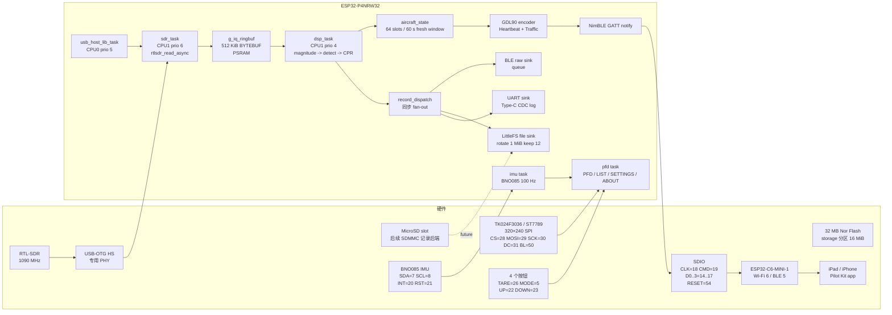

# Pilot Kit Box — 固件架构

英文版：[`architecture.md`](architecture.md)

本文描述当前 ESP32-P4 固件的运行拓扑。当前基线已经包含 RTL-SDR USB Host、Mode-S DSP 解码、LittleFS / UART / BLE 输出、BNO085 姿态融合、TK024F3036 / ST7789 PFD、本地 ADS-B 列表、Settings / About 中英文页面，以及 MODE 长按 deep sleep。

## 总览



## 任务表

| Task | CPU | 优先级 | 栈 | 职责 |
|---|---:|---:|---:|---|
| `usb_host_lib` | 0 | 5 | 4 KiB | 调用 `usb_host_install()` 并持续 pump `usb_host_lib_handle_events()`。 |
| `sdr` | 1 | 6 | 8 KiB | 拥有 USB client，打开 RTL-SDR，配置 1090 MHz / 2 MSPS，运行 `rtlsdr_read_async()`。USB URB 回调在同一任务上下文执行，只负责把 IQ 推入 ring buffer。 |
| `dsp` | 1 | 4 | 4 KiB | 从 IQ ring buffer 取数据，运行 dump1090 派生的幅度计算、前导码检测、曼彻斯特解码和 CPR 定位，并输出 1 Hz dashboard。 |
| `rec_file` | 0 | 3 | 4 KiB | LittleFS 文件写入任务，避免 DSP hot path 被 flash 写入阻塞。 |
| `imu` | 0 | 5 | 4 KiB | 以 100 Hz 读取 BNO085 Rotation Vector，应用软件 tare，提供给 PFD 和校准向导。 |
| `buttons` | 0 | 3 | 3 KiB | 轮询 TARE / MODE / UP / DOWN，处理短按、长按、超长按和 UP+DOWN 组合。 |
| `pfd` | 0 | 4 | 6 KiB | 把 PFD、ADS-B LIST、SETTINGS、ABOUT 和校准向导渲染到 ST7789 framebuffer。 |
| `nimble_host` | 0 | 4 | 4 KiB | NimBLE host 事件循环，通过 C6 的 SDIO / VHCI controller 处理 BLE。 |
| `ble_emit` | 0 | 3 | 6 KiB | 每秒快照 `aircraft_state`，发送 GDL90 Heartbeat 和 Traffic Report，同时发送 raw ts-line 队列。 |

## 内存预算

| 区域 | 大小 | 所有者 |
|---|---:|---|
| IQ ring buffer | 512 KiB | `g_iq_ringbuf`，大块 IQ 缓冲，当前通过 malloc 阈值放入 PSRAM |
| URB pool | 约 96 KiB | 15 × 6400 B USB in-flight transfer |
| DSP 工作集 | 约 12 KiB | 8 KiB IQ buffer + 4 KiB magnitude buffer |
| CPR table | 约 5 KiB | `cpr_decode.c` 中 64 架飞机的 CPR pairing 状态 |
| aircraft_state | 约 7 KiB | `aircraft_state.c` 中 64 slots，保存呼号、高度、位置、速度等 |
| PFD framebuffer | 150 KiB | 320×240×16 bpp framebuffer，位于 PSRAM |
| file sink queue | 约 10 KiB | 256 × `file_record_t` |
| BLE raw queue | 约 5 KiB | 64 × 80 B raw ts-line |
| NimBLE host | 约 30 KiB | GATT DB、连接状态、事件循环等 |
| aircraft DB blob | 约 8.16 MiB flash | `aircraft_db.bin`，通过 `EMBED_FILES` 嵌入，用于 ICAO24 -> 机型/型号/注册号查询 |
| 航司/国家表 | 约 230 KiB + 小型 flash 表 | `airline_codes.c` 和 `icao_country.c`，生成式查找数据，用于呼号和国家显示 |

大块缓冲尽量放入 PSRAM，内部 768 KiB SRAM 留给 DMA-capable 分配、FreeRTOS 栈、ESP-Hosted 队列和 USB host descriptor。

## 故障隔离

```text
URB / IQ stall -> librtlsdr 累计 transfer error，或 dsp_task 检测 IQ 停滞后调用
                  pk_sdr_request_reinit()。sdr_task 关闭并重新打开同一 dongle；
                  连续失败达到上限后才 esp_restart()。

Ring overflow  -> on_iq 中 xRingbufferSend 失败，只累计 drop counter；
                  DSP dashboard 输出 WARN，USB 回调不阻塞。

File queue full -> file sink xQueueSend 失败，记录 drop；
                   DSP path 不等待 flash。

LittleFS write -> fwrite 或 rotation fopen 失败时 writer task 记录错误并退出；
                  UART 和 BLE sink 继续工作。

BLE peer drops -> NimBLE 处理断连；没有订阅者时 notify 被跳过；
                  重新连接后自动继续。
```

## 时间同步

固件没有 RTC，上电时系统时间从 Unix epoch 0 开始。BLE 连接后有两条校时路径：

1. **iOS Current Time Service**：iOS 默认暴露 SIG 标准 CTS（UUID `0x1805`）。固件在 GAP CONNECT 后作为 GATT client 读取 `0x2A2B` 当前时间并调用 `settimeofday()`。
2. **自定义 Time Sync characteristic**：UUID `...0004`，客户端写入 8 字节 little-endian Unix epoch milliseconds。Android 和跨平台客户端推荐使用这一条。

校时前输出的 Mode-S frame 仍会进入所有 sink，只是 `ts_ms` 很小（接近开机以来毫秒数）。客户端可以识别并丢弃这些 pre-sync frame。

### 规划中：载板传感器（GPS / 气压 / microSD）

Pilot Kit Box 载板布线了 GT-U8 GPS（UART + GPIO46 上的 1 PPS）、BMP388
气压计（I²C0，`0x76`），并把记录引到板载 microSD 卡槽。**固件驱动待实现**
—— 设计见
[`superpowers/specs/2026-05-31-gps-baro-timing-storage.md`](superpowers/specs/2026-05-31-gps-baro-timing-storage.md)。
各能力如何接入上面的架构：

- **GPS 授时**：GPS UTC + PPS 校正 `settimeofday()`。**GPS 优先（最准）**，
  BLE 作备份；有覆盖保护，低质量源不会盖掉已校准好的 GPS 时间。设备无需手机即可
  自主校时，SETTINGS 显示同步状态（来源 + 距上次同步时长）。PPS 对齐 UTC 整秒沿，
  提升 Mode-S 时间戳精度。
- **GPS own-ship**：仅在 ADS-B LIST 未手动绑定飞机时作**兜底**；绑定优先。
  接入现有 `aircraft_state` own-ship 路径 + GDL90 ownship report。
- **BMP388 气压**：高度/升降率仅作**参考**显示（增压座舱内失真），不作权威高度。
- **microSD 记录后端**：插卡时优先于 LittleFS；Settings 可选（自动/flash/microSD）。
  扩展上面 `record_dispatch` 的 file sink 路径。

## 数据格式

所有 sink 对同一条 Mode-S frame 使用相同文本形状：

```text
1715432198765 *8D4CA1BD58C386435840BA1AD7CA;
^^^^^^^^^^^^^ ^^^^^^^^^^^^^^^^^^^^^^^^^^^^^^^
    ts_ms      AVR-format Mode-S hex payload
```

这也是 Pilot Kit 离线脚本和 BLE Raw characteristic 使用的格式。GDL90 encoder 是另一路结构化输出，供 EFB / 移动端消费。

## 关键架构选择

1. **RF / USB 工作集中在 CPU1**：减少 BLE、LCD、SDIO 等 CPU0 工作对 2 MSPS IQ path 的抖动影响。
2. **单任务拥有 USB client**：同一个 USB client 不能被多个任务同时 pump。`sdr_task` 是唯一事件泵。
3. **DSP 不阻塞 I/O**：文件、BLE、串口 sink 自己处理背压，DSP loop 保证继续消费 IQ。
4. **wire / disk / BLE raw 格式一致**：`<ts_ms> *<HEX>;` 贯穿串口、文件和 BLE Raw，降低调试和后处理成本。
