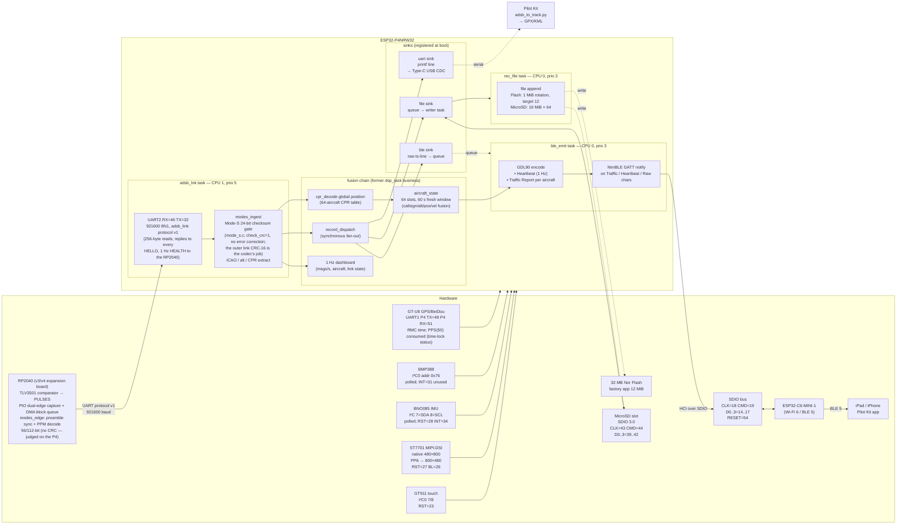

# Pilot Kit Box — Firmware Architecture

Chinese version: [`architecture-zh_CN.md`](architecture-zh_CN.md)

Snapshot of the current 4.3-inch touch runtime topology, including ADS-B,
BLE, GPS NMEA/RMC, barometer, dual storage backends, local traffic UI,
diagnostics, IMU and i18n.

> Scope note: the receive path is the **RP2040 front-end over UART** (v3/v4
> expansion boards). The 1090 MHz envelope is shaped by a TLV3501 comparator;
> the RP2040 captures **both** edges via PIO+DMA — dual edges are load-bearing
> because fused 0→1 pulse pairs (R11) are only rebuildable from edge pairs +
> widths — decodes Mode S, and ships raw frames to the P4's `adsb_lnk` task
> at 921600 baud for CRC filtering and the on-device fusion chain. Capture /
> decode details live in `firmware/rp2040`. The v1/v2-era USB RTL-SDR source
> is retired and no longer diagrammed; it survives only as history rows in
> the task and memory tables below.

## Big picture



## ASCII view (when the SVG render is unavailable)

```
 ┌───────────────── RP2040 (v3/v4 expansion board) ─────────────────┐
 │ TLV3501 ──PULSES──▶ PIO dual-edge capture + DMA block queue      │
 │   (R11: both edges + widths rebuild fused 0→1 pulse pairs)       │
 │ core1: DMA block queue → modes_edge 56/112-bit (no CRC)          │
 └───────────────────────────────┬──────────────────────────────────┘
                                 │ UART protocol v1, 921600 8N1
                                 │ (UART2 RX=46/TX=32; HELLO + 1 Hz HEALTH)
 ┌───────────────────────────────▼────── ESP32-P4-WIFI6 ────────────┐
 │ adsb_lnk task (CPU1, prio 5)                                     │
 │   adsb_link codec → modes_ingest (mode_s.c 24-bit CRC, no fixup)  │
 │     │                                                            │
 │     ├─ cpr_decode global position → aircraft_state (fusion)      │
 │     ├─ 1 Hz dashboard (msgs/s, aircraft, link state)             │
 │     ├─ record_dispatch                                           │
 │     │      │   │   │                                             │
 │     │      ▼   ▼   ▼                                             │
 │     │   uart  file  ble (3)                                      │
 │     │    │     │     │                                           │
 │     │    │     ▼     ▼                                           │
 │     │    │  rec_file  ble_emit (3)                               │
 │     │    │   task      ▼                                         │
 │     │    │   │   GDL90 enc → SDIO → C6 ─────────────▶ iPad /     │
 │     │    │   ▼                                       iPhone      │
 │     │    │  LittleFS (or SD)                         (BLE 5)     │
 │     │    ▼                                                       │
 │     │  Type-C UART ─────────────────────────────────▶ PC /       │
 │     ▼                                                 Pilot-Kit  │
 │  1 Hz console dashboard                               adsb_to_   │
 │                                                       track.py   │
 └──────────────────────────────────────────────────────────────────┘
```

## Task table

| Task              | CPU | Prio | Stack | Role |
|-------------------|-----|------|-------|------|
| `adsb_lnk`        | 1   | 5    | 8 KiB | Runs the RP2040 UART link (adsb_link codec @ 921600 baud, 256-byte reads): feeds CRC-pre Mode-S frames from the RP2040 front-end into modes_ingest, replies to each HELLO, and carries the former DSP business chain (CPR/track/records/1 Hz dashboard). The RP2040 itself captures dual edges via PIO+DMA and decodes 56/112-bit frames with modes_edge; the USB RTL-SDR task pair (`usb_host_lib`/`sdr`) is retired. |
| `dsp`             | —   | —    | —     | **RETIRED** (v1/v2 USB RTL-SDR era): drained the 512 KiB IQ ring buffer and ran dump1090 magnitude + Manchester decode. Not created anymore; its decode/dispatch duties now live in the RP2040 (`modes_edge`) + `adsb_lnk`/modes_ingest chain. Row kept for history. |
| `rec_file`        | 0   | 3    | 4 KiB | File writer selected at boot from NVS: LittleFS or MicroSD, with LittleFS fallback when the requested card is absent. Keeps the link/decode path off storage writes. |
| `gps`             | 0   | 4    | 4 KiB | Parses GT-U8 UART1 NMEA (RMC/GGA/GSV/TXT), maintains GPS/BeiDou fix, satellite/SNR and antenna state, and sets time from RMC. GPIO50 PPS is consumed into the `time_locked` status (ISR count + 1 Hz snapshot); feeding it into the system clock is a follow-up task. |
| `imu`             | 0   | 5    | 4 KiB | Polls BNO085 rotation-vector reports at 100 Hz, applies software tare, and feeds the PFD / calibration wizard. |
| `baro`            | 0   | 4    | 4 KiB | Lightweight task: polls BMP388 over I²C0 at ~10 Hz, runs temperature-compensated pressure-to-altitude conversion, computes vertical speed, and writes results into `g_baro_state` (QNH-adjustable). |
| `sd_detect`       | 0   | 2    | 4 KiB | Probes an absent MicroSD every 3 seconds; checks mounted-card health and refreshes cached capacity every 2 seconds. |
| `buttons`         | —   | —    | — | Legacy source retained but not started on the 4.3-inch touch board. |
| `pfd`             | 0   | 4    | 6 KiB | Renders PFD and UI views into the 800×480 logical framebuffer at ~30 FPS. |
| `nimble_host`     | 0   | 4    | 4 KiB | NimBLE host event loop, hosts the GATT server; events arrive from the C6 controller over the SDIO/VHCI transport. |
| `ble_emit`        | 0   | 3    | 6 KiB | 1 Hz timer task: snapshots `aircraft_state` and emits GDL90 Heartbeat + one Traffic Report per fresh aircraft on the BLE notify pipes; also drains the raw-ts-line queue produced by the BLE sink. |

## Memory budget

| Region | Size | Owner |
|--------|------|-------|
| IQ ring buffer | 512 KiB | **RETIRED (v1/v2 USB RTL-SDR era):** `g_iq_ringbuf` — removed with the retired receive path; PSRAM now backs map tiles/fonts/recording and the other working sets below |
| URB pool       | ~96 KiB | **RETIRED:** 15 × 6400 B in-flight USB transfers |
| DSP working set| ~12 KiB | **RETIRED:** 8 KiB IQ buf + 4 KiB magnitude buf |
| CPR table      | ~5 KiB  | 64 aircraft slots in `cpr_decode.c` |
| aircraft_state | ~7 KiB  | 64 slots in `aircraft_state.c` (callsign + alt + position + velocity) |
| Application framebuffer | 750 KiB | 800×480×16 bpp RGB565-swapped in PSRAM |
| DPI framebuffers | 1.5 MiB | Two 480×800×16 bpp scanout buffers in PSRAM |
| file_sink queue| ~10 KiB | 256 × 40 B `file_record_t` items |
| ble_raw queue  | ~5 KiB  | 64 × 80 B ts-line strings for the BLE Raw characteristic |
| NimBLE host    | ~30 KiB | event loop, GATT DB, peer connection state (typical IDF v6 footprint) |
| aircraft DB blob | ~8.21 MiB PSRAM | `/sdcard/aero/pk_actdb.bin`, lazily loaded into PSRAM by `aircraft_db.c` for ICAO24 -> type/model/registration lookup. No longer embedded in flash; without the card the lookup simply stays empty and the buffer is freed on card removal |
| airline/country tables | ~230 KiB + small table in flash | `airline_codes.c` and `icao_country.c`, generated lookup data for callsign and country display |

Large bulk buffers now live in PSRAM where practical, preserving the
P4's 768 KiB internal SRAM for DMA-capable allocations, FreeRTOS stacks,
ESP-Hosted queues, and USB host descriptors.

## Failure isolation

```
RP2040 edge-cap   → queue-full stops the DMA (overrun counter + lost flag).
overrun / restart   On re-arm the PIO SM is restarted and the RX FIFOs are
                    cleared; the first re-armed block is flagged discontinuous,
                    so core1 runs modes_edge_reset() before feeding it — no
                    frames are stitched across the gap. A lone dropped edge
                    mid-burst (RXSTALL) garbles only that one frame; the
                    decoder drops it naturally. Everything surfaces in the
                    1 Hz HEALTH ovr counter.

Link stall      → RP2040: a core1 decoder stall >5 s trips the core0
                    watchdog, which sends ERROR(code=2) over the link.
                    P4: no valid frame for >5 s after having been linked
                    marks the link STALLED (seq gaps / resyncs counted per
                    protocol v1); DIAG shows the link state.

File queue full→ file sink xQueueSend returns pdFALSE → s_dropped++;
                 every 256 drops the writer task logs a WARN. The ingest
                 path never stalls.

Storage write → LittleFS/MicroSD fwrite or rotation failures are logged;
  error          UART and BLE sinks continue. Card removal is detected
                 and unmounted, but the file backend does not switch
                 dynamically during the same boot.

BLE peer drops → NimBLE handles GAP/connection state; ble_gatt_task
                 keeps draining its queue and discards notifies when no
                 peer is subscribed. Reconnect is transparent.
```

## Time synchronisation

The firmware boots with system time at Unix epoch 0 (no RTC or
battery-backed clock). Three paths can seed wall-clock time, with
source-quality protection preventing a lower-quality source from
overwriting a better one:

1. **GT-U8 RMC** — RMC supplies UTC date/time. This is the preferred
   source. GPIO50 is only a proposed PPS wire; current firmware has no PPS
   GPIO input or discipline loop.
2. **iOS Current Time Service** (BLE SIG std., UUID 0x1805) —
   immediately after every `GAP CONNECT` the firmware acts as a
   GATT client toward the peer's CTS, reads the 10-byte UTC date-time
   payload, and calls `settimeofday()`. iOS exposes CTS by default,
   so this is zero-config on Apple platforms.
3. **Custom Time Sync characteristic** (UUID `…0004`, R/W) — any
   client can `write` an 8-byte little-endian Unix-ms value; the
   firmware applies it via `settimeofday()`. Reads return the
   current firmware-perceived epoch_ms. Used by mobile clients on
   Android (no system CTS) and any other cross-platform clients.

See [`docs/ble_protocol.md`](ble_protocol.md) for the BLE wire
format; the diagram below focuses on the two BLE-assisted paths.

```
Mobile peer ── GAP_CONNECT ──► ble_gatt              adsb_lnk
                                  │                   │
                                  ▼                   ▼
                          ble_gatt::gap_event_cb     record_dispatch emits
                                  │                  ts_ms from gettimeofday()
                                  ▼                  on every Mode-S
                          time_sync_kickoff           frame, so the
                                  │                   stamp magically
              ╭───────────────────┴───────────────────╮ "catches up" the
              ▼                                       ▼  moment either
       ble_gattc_disc_svc_by_uuid(0x1805)      Time Sync char write
       (silent no-op on Android)               (epoch_ms LE u64)
              │                                       │
              ▼                                       ▼
       ble_gattc_read(0x2A2B)              chr_time_access_cb
              │ parse 10 B CTS UTC                    │
              ▼                                       ▼
              ╰─────────► apply_epoch_ms() ◄──────────╯
                              │
                              ▼
                       settimeofday(),
                       all subsequent
                       ts_ms are real UTC
```

Frames produced before the first sync still go down all sinks; the
ts_ms reads small (seconds since boot). Clients can detect and
discard them — the reference Pilot Kit app does.

### Carrier-board sensors (GPS / baro / microSD)

Pilot Kit connects a GT-U8 GPS over UART, a BMP388 barometer (I²C0,
`0x76`), and uses the Rev1.2 board's microSD slot. GPIO50 may be reserved
for future PPS work, but that path is not implemented.
How each slots into the architecture:

- **GPS time sync** (`gps_task.c`) — GPS UTC from RMC seeds `settimeofday()`. GPS is
  **preferred (most accurate)**, BLE is the backup; overwrite protection
  keeps a lower-quality source from clobbering a good GPS fix. The clock
  self-disciplines without a phone, and DIAG shows system time, fix,
  constellation, and SNR state. There is no PPS-edge timestamp correction.
- **GPS own-ship** (`gps_task.c`) — used when no compile-time ADS-B own-ship
  ICAO is active. Feeds the same
  `aircraft_state` own-ship path + GDL90 ownship report.
- **BMP388 baro** (`baro_task.c`) — altitude / vertical-speed shown as a **reference
  only** (unreliable in a pressurised cabin), never the authoritative
  altitude. QNH is user-adjustable from SETTINGS.
- **microSD record sink** — Settings selects Flash or MicroSD and stores
  the choice in NVS for the next boot. A missing requested card falls
  back to LittleFS. Flash rotates at 1 MiB with a 12-file count target
  constrained by the 10 MiB partition; MicroSD rotates
  16 MiB × 64 files (about 1 GiB) and supports guarded FAT32 formatting.

## What goes on the wire / on disk

The exact line shape every sink produces for one Mode-S frame:

```
1715432198765 *8D4CA1BD58C386435840BA1AD7CA;
^^^^^^^^^^^^^ ^^^^^^^^^^^^^^^^^^^^^^^^^^^^^^^
 │             │
 │             └── AVR-format hex payload of the Mode-S frame
 │                 (14 bytes for DF17/18, 7 bytes for DF11)
 └── gettimeofday() in milliseconds; pre-SNTP this is boot-relative
```

This format is exactly what `Pilot-Kit/scripts/adsb_to_track.py`
ingests (`parse_ts_line()` in that file), so the firmware → Python
pipeline is a single `cat | adsb_to_track.py` away from producing
GPX / KML tracks.

## Why this shape

A few non-obvious choices that this diagram makes load-bearing:

1. **All 1090 MHz timing work runs on the RP2040.** PIO + DMA capture dual
   edges into a hardware-timed block queue with no RTOS on the capture
   path — P4 scheduler jitter never touches pulse timing. Dual edges are
   load-bearing: fused 0→1 pulse pairs (R11) are only rebuildable from
   edge pairs + widths.

2. **One task owns the UART link.** `adsb_lnk` is the sole codec reader on
   the P4; the RP2040 sends only from its core0 sender loop. Protocol v1
   keeps per-sender sequence numbers, the HELLO handshake and 1 Hz HEALTH.

3. **The fusion chain never blocks on I/O.** Backpressure is lossy by
   design at every hop: the RP2040 frame ring drops (counted) when the P4
   lags, and the file/BLE sinks keep their own queues. Decode/ingest
   forward progress is guaranteed regardless of what flash, BLE peers,
   or operators do.

4. **The raw on-wire format matches the on-disk format.** Serial,
   LittleFS, and the BLE Raw characteristic all use the same
   `<ts_ms> *<HEX>;` line shape. The GDL90 encoder is the structured
   BLE traffic path, while raw ts-lines remain the debug and
   compatibility path.
