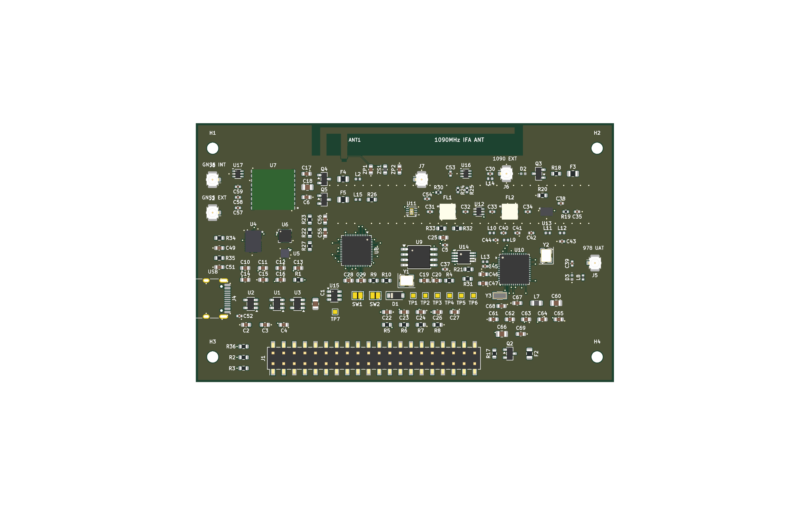

# Expansion Board V3.9 Design (Archived)

  

> **This board is superseded by [Expansion Board V4](../expansion-board-v4/).**
> V3.9 is the final maintenance design with the QPL9547, comparator, detector,
> decoupling, reset, and USB corrections. The GNSS RF/bias topology was verified
> correct and must not receive a Gate-swap rework. BNO085 remains at 0° on V3.9; firmware must use
> the V3 coordinate transform instead of V4's 90° transform.
> The fabricated V3.2 batch remains useful for firmware debugging and antenna
> research; its GNSS selection Gate wiring must be left unchanged.

| Document | Contents | Lang |
|---|---|---|
| [`PINMAP.md`](PINMAP.md) | Authoritative pin and net map for the V3.9 design | EN / [中文](PINMAP-zh_CN.md) |
| [`ASSEMBLY.md`](ASSEMBLY.md) | Hand-assembly placement list | EN / [中文](ASSEMBLY-zh_CN.md) |
| [`CHECKLIST.md`](CHECKLIST.md) | Per-reference BOM checklist (also [.xlsx](CHECKLIST.xlsx) / [.pdf](CHECKLIST.pdf)) | EN / [中文](CHECKLIST-zh_CN.md) |
| [`ASSEMBLY_MAP.pdf`](ASSEMBLY_MAP.pdf) | Color-coded assembly map — every designator's position, orientation and category (2 pages) | PDF |
| [`BASEBOARD_REF.md`](BASEBOARD_REF.md) | Mechanical reference for the Waveshare carrier | EN / [中文](BASEBOARD_REF-zh_CN.md) |

Engineering working notes (board bring-up records, antenna studies, layout
constraints, purchasing history) are kept out of the public tree.

---

# 扩展板 V3.9 设计（已归档）

  

> **本板已被[扩展板 V4](../expansion-board-v4/) 取代。**
> V3.9 是包含 QPL9547、比较器、检波、去耦、复位和 USB 修正的最终维护设计。
> GNSS RF/偏置拓扑已复核为正确，禁止交换 PMOS Gate。
> V3.9 的 BNO085 保持 0°，固件必须使用 V3 坐标变换，不能套用 V4 的 90° 变换。已经打样的 V3.2
> 仍可用于固件调试与天线研究，其 GNSS 选择 Gate 接线也必须保持不变。

| 文档 | 内容 | 语言 |
|---|---|---|
| [`PINMAP.md`](PINMAP.md) | V3.9 设计权威引脚/网络映射 | [EN](PINMAP.md) / 中文 |
| [`ASSEMBLY.md`](ASSEMBLY.md) | 手工贴片点位清单 | [EN](ASSEMBLY.md) / 中文 |
| [`CHECKLIST.md`](CHECKLIST.md) | 按位号贴片核对表（另附 [.xlsx](CHECKLIST.xlsx) / [.pdf](CHECKLIST.pdf)） | [EN](CHECKLIST.md) / 中文 |
| [`ASSEMBLY_MAP.pdf`](ASSEMBLY_MAP.pdf) / [`-zh_CN`](ASSEMBLY_MAP-zh_CN.pdf) | 彩色装配图：逐位号的位置/方向/类别，含位号速查表（2 页） | PDF |
| [`BASEBOARD_REF.md`](BASEBOARD_REF.md) | 微雪载板机械参数基准 | [EN](BASEBOARD_REF.md) / 中文 |

工程过程记录（bring-up 记录、天线研究、布线约束、采购历史）不进公开目录。
