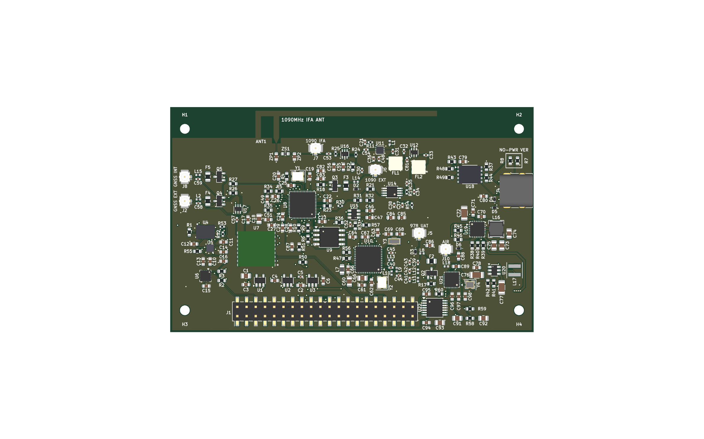
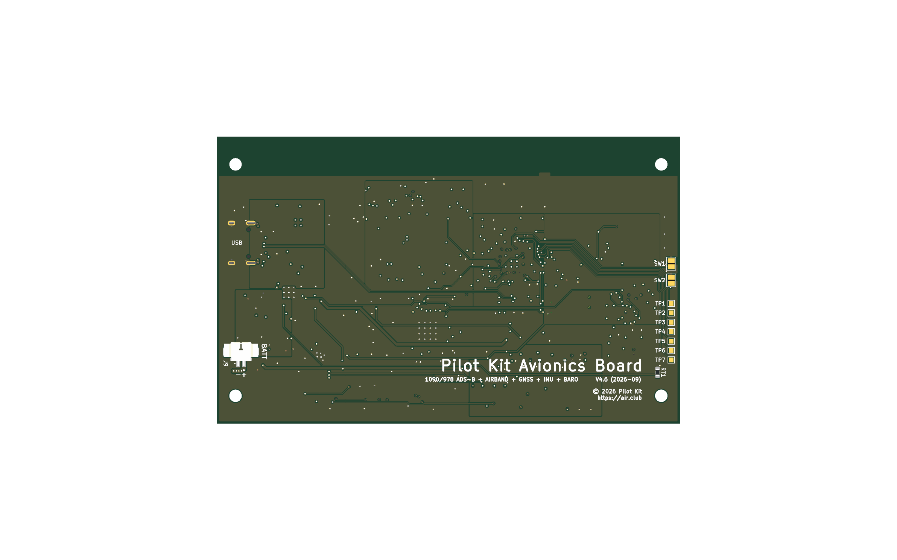

# Pilot Kit Avionics Board V4.0

**Integrated ADS-B / GNSS / IMU expansion board for the Pilot Kit Box**
集成 ADS-B / GNSS / IMU 扩展板

<p align="center">
  
</p>

A 6-layer, 100.1 × 62.1 mm HAT that stacks onto the Waveshare
ESP32-P4-WIFI6-Touch-LCD-4.3 carrier's 2×20 header. It replaces the four
discrete modules used by the current prototype (RTL-SDR dongle, BNO085,
GT-U8 GNSS, BMP388) with a single board — **including its own 1090 MHz
receive chain, so no RTL-SDR dongle is required.**

6 层、100.1 × 62.1 mm，以 HAT 方式直插微雪 ESP32-P4-WIFI6-Touch-LCD-4.3
载板的 2×20 排母，把现有原型的四个分立模块（RTL-SDR dongle、BNO085、
GT-U8 GNSS、BMP388）整合成一块板，**自带 1090 MHz 接收链，不再需要 dongle**。

---

## ⚠️ Status / 当前状态

> **This board has never been fabricated.** The design is complete and passes
> every automated check listed below, but **no physical board exists yet** and
> nothing here has been validated against hardware.
>
> **这块板从未打样。** 设计已完成并通过下列全部自动检查，
> 但**实物尚不存在**，所有内容都未经硬件验证。

| | Status / 状态 |
|---|---|
| Schematic / 原理图 | ✅ Complete / 完成 |
| Layout & routing / 布局布线 | ✅ Complete — 0 DRC violations, 0 unconnected nets / 零违例、未连通 0 |
| Manufacturing files / 制造文件 | ✅ Gerber + drill export cleanly / 可正常导出 |
| **Fabrication / 打样** | ❌ **Not yet ordered / 尚未下单** |
| **Bring-up / 上电验证** | ❌ **Not started / 未开始** |
| **On-board IFA antenna / 板载 IFA 天线** | ⚠️ **Laid out but NOT tuned / 已落板但未调谐** |

**About the IFA antenna** — the 1090 MHz inverted-F antenna is drawn at
52.0 mm as a starting length. It **must** be tuned with a VNA in the final
enclosure: the matching network ships as a straight-through (`ZS1`=0R,
`ZP1`/`ZP2`=DNP) and the HFSS starting point (3.6 nH / 3.3 pF) is a first
sweep value, **not a production value**. Enclosure, battery, and screws all
shift the resonance. See [`BOM_IFA_TUNING.md`](BOM_IFA_TUNING.md).

板载 1090 MHz 倒 F 天线按 52.0mm 画长，**必须**装盒后用 VNA 调谐：
匹配网络出厂是直通，HFSS 起点 3.6nH/3.3pF 只是首轮扫值**不是量产值**。
外壳、电池、螺丝都会改变谐振点。

---

## Specifications / 规格

| | |
|---|---|
| **Outline / Layers** | 100.1 × 62.1 mm, 6 layers |
| **Stackup** | JLC06161H-3313 — 0.0994 mm L1→In1 dielectric, 0.15 mm 50 Ω microstrip |
| **Layer usage** | F.Cu signal · In1 solid GND (RF reference) · In2 signal · In3 3V3 plane · In4 solid GND · B.Cu signal |
| **1090 MHz RX** | QPL9547 LNA → TA0970A SAW → BGA2817 → AD8313 log detector → TLV3501 comparator → RP2040 PIO decoder |
| **978 MHz UAT** | CC1312R1F3RGZR sub-GHz transceiver, differential LC match |
| **Antennas** | On-board 1090 IFA + 3 × U.FL (1090 ext / 978 / GNSS), PMOS-switched bias tees |
| **GNSS** | ATGM336H-6N-74, switchable internal patch / external antenna |
| **Sensors** | BNO085 IMU (100 Hz fusion), BMP388 barometer, QMC5883P magnetometer |
| **Power** (optional) | CH224K USB-PD sink @9 V → SY6970 charger + fuel gauge → SY7069 5 V boost, single-cell Li-po |
| **Host interface** | 2×20 SMD header, HAT-style stacking onto the carrier |
| **Scale** | 177 placements, 386 vias (all ≥0.30 mm drill), 1381 track segments |

Two assembly variants — with and without the on-board power section.
See [`VARIANTS.md`](VARIANTS.md).
两个装配变体（带/不带板载电源），选贴规则见该文档。

<p align="center">
  
</p>

---

## Documentation / 文档

Every board document ships in two languages: the English original
(`*.md`) and the Simplified-Chinese working notes (`*-zh_CN.md`) it was
authored in. Tables, part numbers, and net names are identical in both.

| Document | Contents | Lang |
|---|---|---|
| [`PINMAP.md`](PINMAP.md) | Authoritative pin and net map — the single source of truth for the schematic | EN / 中文 |
| [`VARIANTS.md`](VARIANTS.md) | Powered vs. unpowered assembly variants (inverted logic — read before ordering) | EN / 中文 |
| [`ASSEMBLY.md`](ASSEMBLY.md) | Hand-assembly placement list, generated from the board | EN / 中文 |
| [`ASSEMBLY_MAP.pdf`](ASSEMBLY_MAP.pdf) / [`ASSEMBLY_MAP-zh_CN.pdf`](ASSEMBLY_MAP-zh_CN.pdf) | Color-coded full-board assembly maps (placement semantics, three pages each) | PDF |
| [`SELECTIVE_PLACEMENT.md`](SELECTIVE_PLACEMENT.md) | Selective-placement groups and **mutex rules** — which parts must never be populated together | EN / 中文 |
| [`CHECKLIST.md`](CHECKLIST.md) | Per-reference BOM checklist for hand placement (also [.xlsx](CHECKLIST.xlsx) / [.pdf](CHECKLIST.pdf)) | EN / 中文 |
| [`BOM_PURCHASE.md`](BOM_PURCHASE.md) | Authoritative purchasing list, generated from the netlist | EN / 中文 |
| [`BOM_IFA_TUNING.md`](BOM_IFA_TUNING.md) | Antenna tuning kit and the VNA procedure | EN / 中文 |
| [`BASEBOARD_REF.md`](BASEBOARD_REF.md) | Mechanical reference for the Waveshare carrier | EN / 中文 |

---

## Manufacturing package / 制造包

Pre-built packages live in [`release/`](release/):

| File | Use |
|---|---|
| `expansion-board-v4-gerber-JLC-*.zip` | **Use this to order** — RS-274-X, 15 files |
| `expansion-board-v4-kicad-*.zip` | Archive / further development. **Not accepted by the fab** |
| `expansion-board-v4-gerber-*.zip` | ⚠️ Older export in Gerber **X2** format — do not use |

### ⚠️ Three things that will ruin the board if set wrong

1. **Gerbers must be RS-274-X, not X2.** JLCPCB accepts neither KiCad project
   files nor Gerber X2. KiCad exports X2 by default, so the release package is
   regenerated with `--no-x2 --no-netlist`. Because only Gerbers can be
   uploaded, **the via treatment cannot be selected on the web form — it has to
   go in the order notes.** Ready-to-paste text is in the order guide below.
2. **The stackup must be JLC06161H-3313.** All 28 controlled-impedance RF nets
   are 0.15 mm wide because that stackup's L1→In1 dielectric is 0.0994 mm.
   A different stackup silently breaks 50 Ω and degrades 1090/978 sensitivity.
3. **`J4`'s four `SH` holes must NOT be resin-plugged.** They are ⌀0.60 mm
   plated *slots* (Excellon `G85`) that mechanically anchor the USB-C
   receptacle. Plug them and the connector will tear off after a few
   insertions. The soldermask layer already encodes the distinction (SH is
   opened, the EP thermal vias are tented) — the fab should follow it.

---

## Rebuilding from source / 从源重建

The board is **generated and verified by scripts**, not hand-maintained. The
schematic, placement, routing, zones, and silkscreen are all frozen into
version-controlled data files, so the board can be reproduced bit-for-bit.

板子由**脚本生成和校验**，不是手工维护。原理图、布局、布线、覆铜和丝印
全部固化为受版本控制的数据文件，可 1:1 复现。

```bash
# Reproduce the board from frozen data (seconds, deterministic)
# 从固化数据复现（秒级，结果确定）
bash tools/rebuild.sh

# Re-run the full auto-router from scratch (~10 min, non-deterministic)
# 从零重新布线（约 10 分钟，结果每次不同）
bash tools/run_route.sh
```

Requires KiCad 10 (uses its bundled Python for `pcbnew`).
需要 KiCad 10（使用其自带 Python 的 `pcbnew`）。

### Verification scripts / 校验脚本

These run as part of both build chains and **fail loudly** rather than
warning — every one of them exists because something slipped through silently
at least once.

它们是两条构建链的一部分，**失败即中断**而不是警告——
每一个都是因为某件事曾经静默溜过去才加上的。

| Script | Guards against |
|---|---|
| `check_route.py` | RF nets leaving F.Cu, vias puncturing the In1 reference plane, sub-0.30 mm drills, connector through-holes losing their soldermask opening |
| `check_docs_sync.py` | Documentation coordinates drifting from the board; document titles carrying a stale revision |
| `enforce_via_spec.py` | Library footprints reintroducing sub-spec via-in-pad drills on rebuild |
| `free_area.py` / `diff_layout.py` | Placement regressions between runs |

---

## License / 许可

MIT, same as the parent repository — see the
[main README](../../README.md#开源协议--license).
与主仓库一致（MIT）。

The KiCad project embeds footprints from the KiCad standard libraries, which
are CC-BY-SA 4.0 with an exception explicitly permitting unrestricted use of
boards produced from them — so this does not impose copyleft on your hardware.
本工程内嵌了 KiCad 官方库的封装（CC-BY-SA 4.0，但其例外条款明确允许
由此制造的板子不受限制使用，不会传染到你的硬件）。
