# Image Assets

Chinese version: [`README-zh_CN.md`](README-zh_CN.md)

## 4.3″ Touchscreen UI (`ui-4.3-*.png`)

Rendered by the simulator, **pixel-identical to the real device** — the simulator compiles the very same drawing
modules used in the firmware (`firmware/main/pfd_*.c`, `pk_ui_nav.c`), not a separately drawn mock-up.

All are 800×480, the same as the panel's logical resolution, and can be used directly in the README and on the website.

| Image | Scene |
|---|---|
|  | **PFD home**. Attitude indicator, left/right speed/altitude tapes, bottom HSI compass with traffic overlay, three info lines on each side |
| 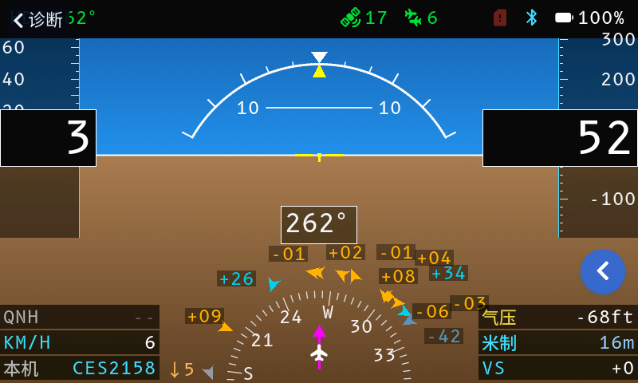 | **Subpage**: top bar "← Diagnostics", FAB changes to ← as well |
| 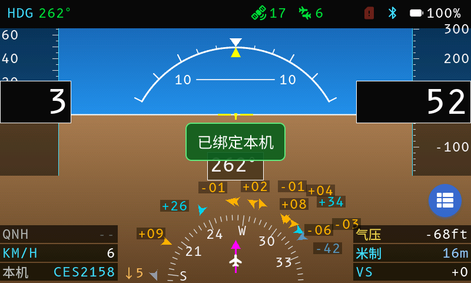 | **Toast** notification, layered above all controls |
| 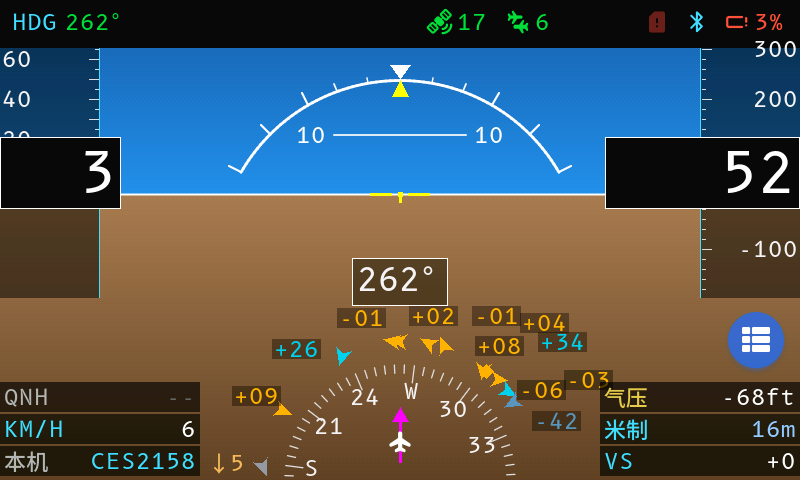 | **Low battery**: battery icon switches to alert and turns red along with the value |
|  | **Charging**: battery plays a frame-by-frame animation |
| 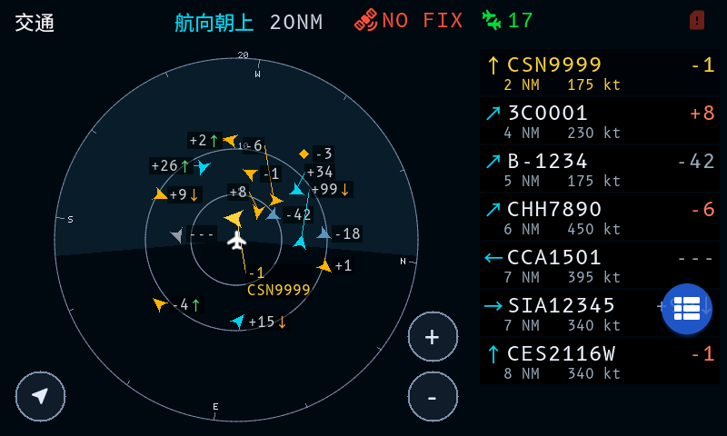 | **Traffic page normal state**: 360° radar + target list on the right |
| 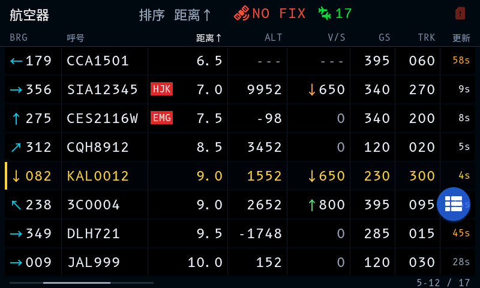 | **List board normal state**: eight-column table, with threat-row highlighting and badges |
| 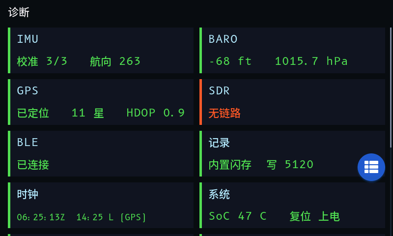 | **Diagnostics overview normal state**: all eight subsystem cards green |
| 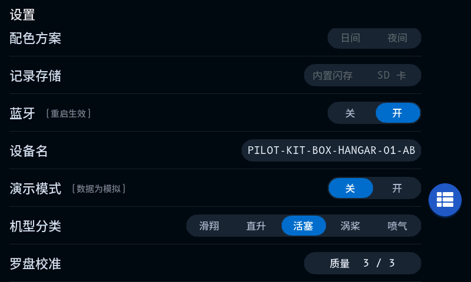 | **Settings page bottom**: the demo mode row (off) |
| 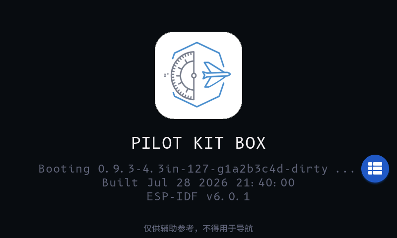 | **Splash screen** (demo mode off) |

## Demo Mode (`demo-4.3-*.png`)

Demo mode swaps all four data sources for synthetic values, so the normal state can be verified on the real device
without peripherals attached. Its safety baseline is "if it is on, it must be visible", and the badge is drawn at the
control layer, independent of each page's drawing code — **the only way to prove the badge is on every page is to
capture every page**. Miss one page, and that page may lack the badge without anyone knowing. One set each for Chinese
and English: the badge is squeezed into the right end of the top bar, and each page has to yield width for it, while
English copy is much longer than Chinese.

| Image | Scene |
|---|---|
| 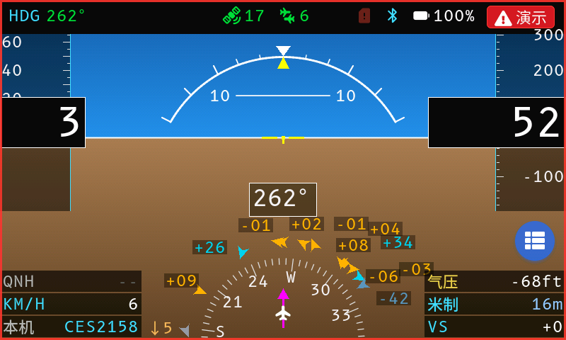 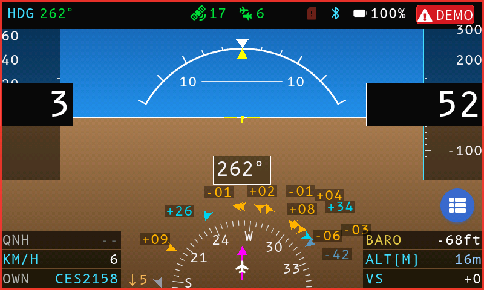 | **PFD**: red-background ⚠ demo badge at the right end of the top bar + red frame around the whole screen; the status group shifts left to make room |
| 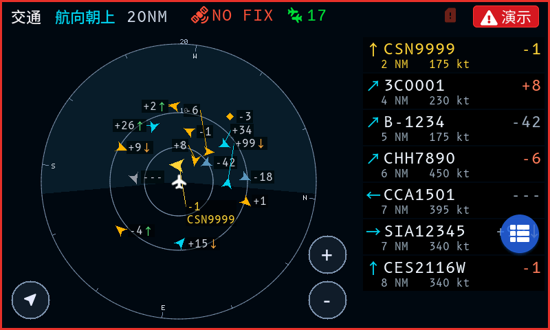 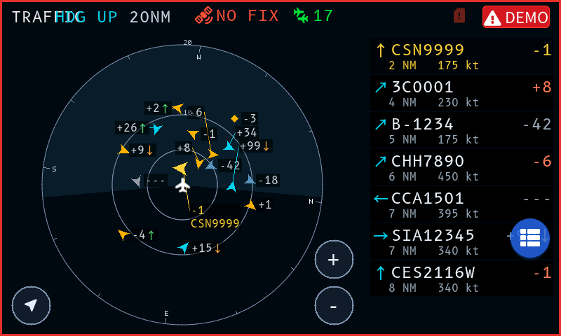 | **Traffic page**: heading/range shift left |
| 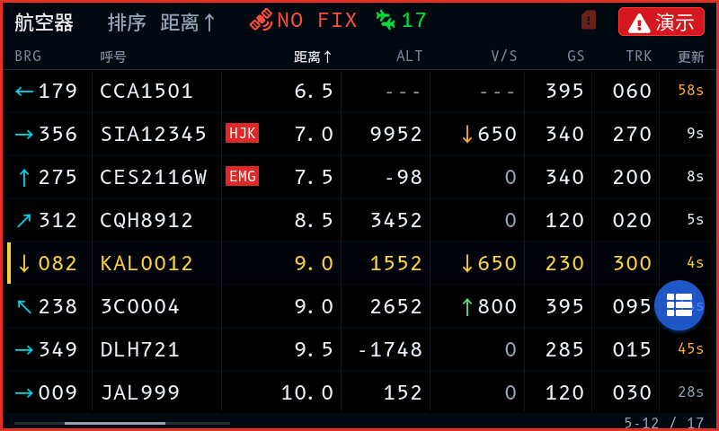 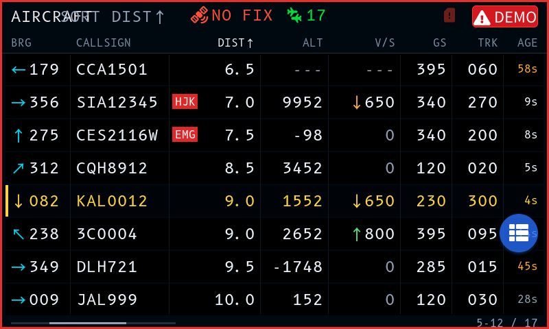 | **List board**: sort hint and RESET shift left |
| 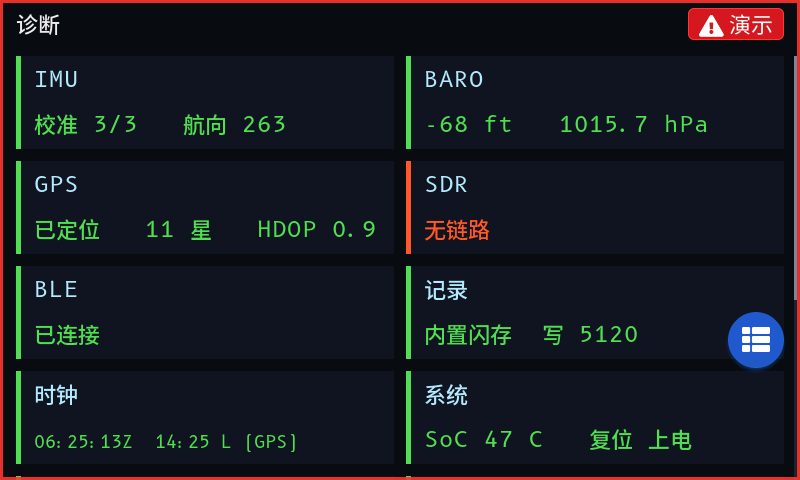 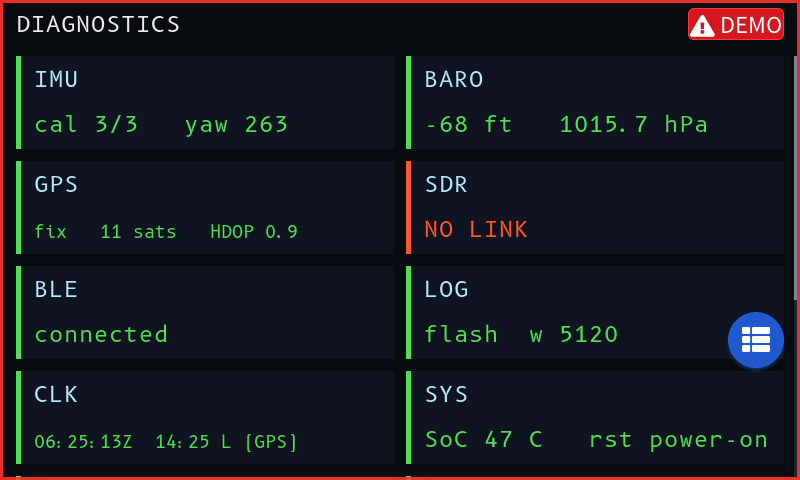 | **Diagnostics**: the top bar only has the title at the top left; no yielding needed |
| 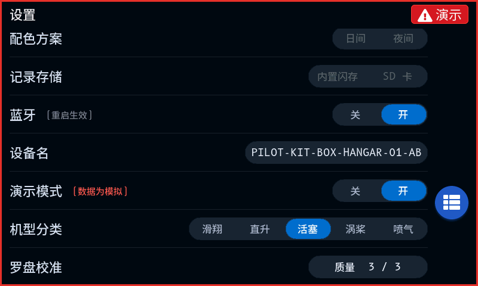 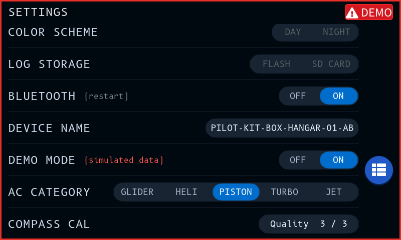 | **Settings page**: demo mode switch is "on", the small hint text turns red |
| 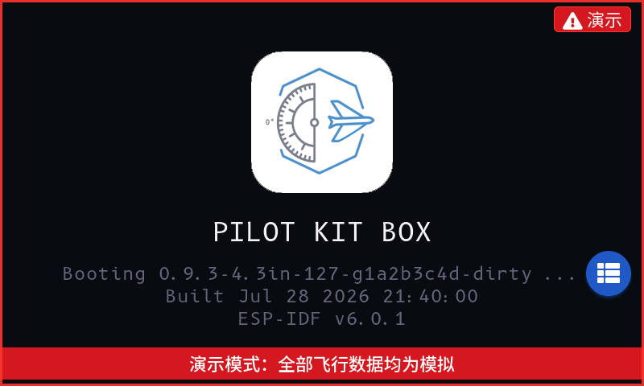 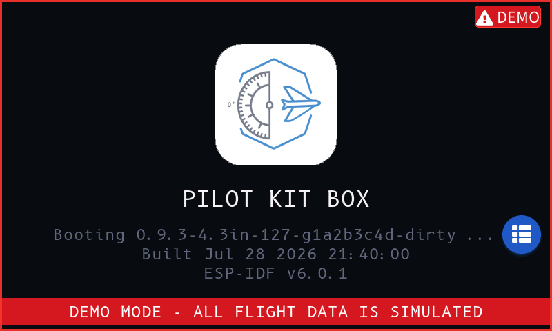 | **Splash screen**: red banner at the bottom. On the real device this screen renders before LVGL, so it has only the banner, no badge; the simulator draws both |

### Regenerating

```bash
python3 sim/capture.py            # all
python3 sim/capture.py --only dock  # dock-related only
```

After a UI change, re-run it once, then use `git diff --stat images/` to see which scenes were affected — unchanged
images are not recorded by git, while changed ones are obvious at a glance; it amounts to a lightweight visual
regression suite.

Scene definitions live in the `SCENES` table of `sim/capture.py`; each entry is just a set of simulator environment
variables.

> **The PFD home has no Chinese/English pair**: that screen consists entirely of internationally standardized
> symbols, numbers, and fixed abbreviations (HDG / KM/H / ALT / VS) — not a single i18n string — so both languages
> render byte-for-byte identical. This matches how ICAO standard instruments are not localized — language only
> affects text-driven screens such as navigation and settings.

## 2.4″ Version and Hardware (Remaining Files)

`PFD.jpg` / `radar-traffic.jpg` / `adsb-list.jpg` are **real photos** of the 2.4″ version;
`pcb-*` / `3d-case-*` / `assemble*` are hardware and assembly images.
