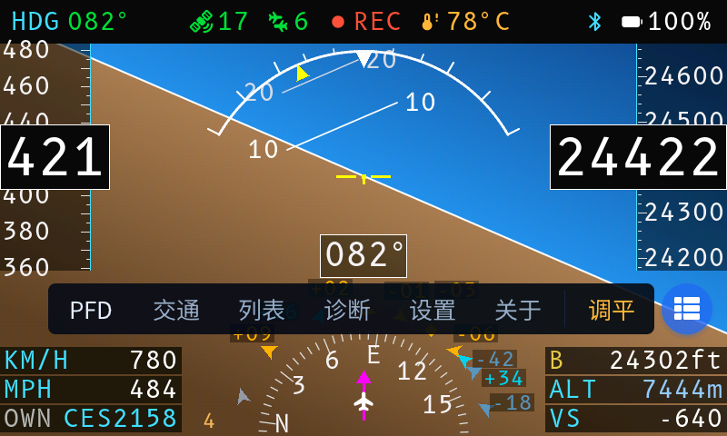
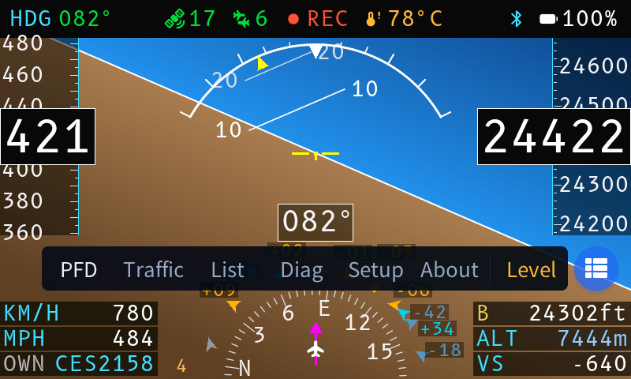
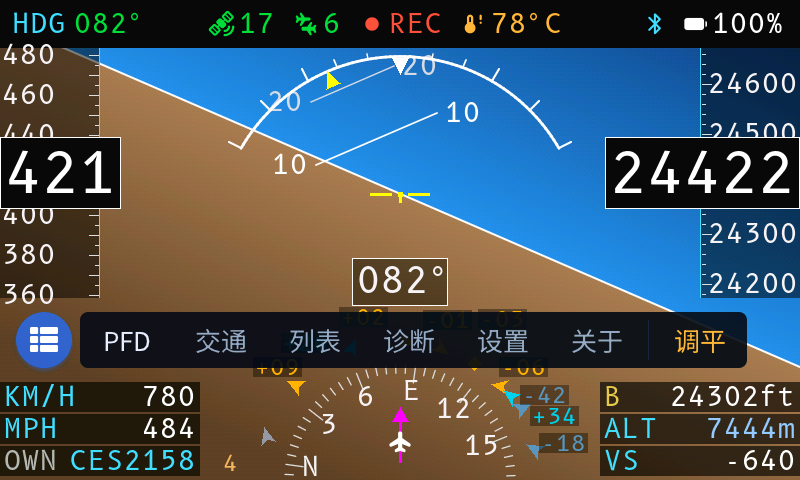

# 图片资源

## 4.3″ 触摸屏 UI（`ui-4.3-*.png`）

由模拟器渲染，**与真机逐像素一致** —— 模拟器编译的就是固件里那批绘制模块
（`firmware/main/pfd_*.c`、`pk_ui_nav.c`），不是另画一份效果图。

全部 800×480，与面板逻辑分辨率相同，可直接用于 README 与官网。

| 图 | 场景 |
|---|---|
|  | **PFD 主页**。姿态仪、左右速度/高度带、底部 HSI 罗盘与交通目标叠加、左右各三行信息 |
|  | **dock 展开**：六个一级页签 + 分隔线 + 动作区「调平」 |
|  | 同上英文版。英文是变宽字体，页签宽度按这一侧定 |
|  | **FAB 吸在左缘**，dock 随之反向铺开 |
|  | **二级页面**：顶栏「← 诊断」，FAB 同时变 ← |
|  | **Toast** 提示，压在所有控件之上 |
|  | **低电量**：电池图标转 alert 并与数值一同变红 |
|  | **充电中**：电池播放逐帧动画 |

### 重新生成

```bash
python3 sim/capture.py            # 全部
python3 sim/capture.py --only dock  # 只出 dock 相关
```

UI 改动后重跑一次，再用 `git diff --stat images/` 看哪些场景受影响 —— 没变的
图 git 不会记录，变了的一眼可见，等于一套轻量的视觉回归。

场景定义在 `sim/capture.py` 的 `SCENES` 表里，每一项就是一组模拟器环境变量。

> **PFD 主页没有中英两版**：那一屏全是国际通用的符号、数字与固定缩写
> （HDG / KM/H / ALT / VS），一个 i18n 词条都没有，两种语言渲染逐字节相同。
> 这与 ICAO 标准仪表不做本地化一致 —— 语言只影响导航与设置这类文字界面。

## 2.4″ 版本与硬件（其余文件）

`PFD.jpg` / `radar-traffic.jpg` / `adsb-list.jpg` 是 2.4″ 版本的**实拍**照片；
`pcb-*` / `3d-case-*` / `assemble*` 是硬件与装配图。
